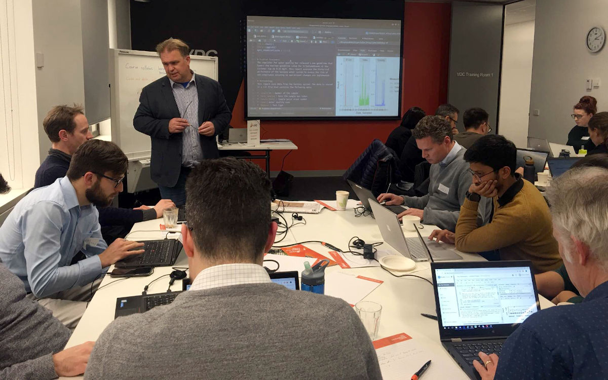
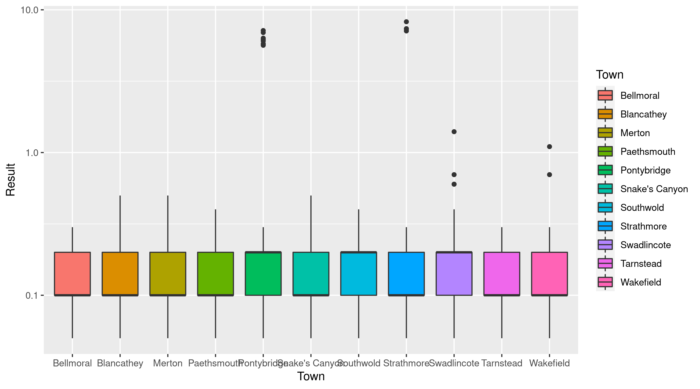

# 1. Data Science for Water Professionals {#introduction}
{width: 100%}

Managing reliable water services requires not only a sufficient volume of water but also significant amounts of data. Water professionals continuously measure the flow and quality of water and assess how customers perceive their service. Water utilities are awash or even flooded with data. Data professionals use data pipelines and data lakes and make data flow from one place to another.

Data and water are, as such, natural partners. Professionals in the water industry rarely directly interact with water or customers, but they constantly analyse data that describes these realities. Analysing data maintains or improves the level of service to customers and minimises the impact on the natural environment.

Most professionals use spreadsheets to collect and analyse data and present the results. While these tools are convenient, they are not ideal when working with large and complex data sets. Specialists in data analysis prefer to write code in one of the many available computing languages.

This course introduces water utility professionals to the [R language](https://www.r-project.org/) for data science. This language is a popular and versatile tool among data scientists to create value from data. R can also be easily integrated with business intelligence systems such as Power BI.

Other programming languages, such as Python, Stata or Julia, are equally suitable to analyse data. Each programming language has a specific strength and some analysts combine languages to solve complex problems. 

The R language is specifically designed to analyse and visualise data. The course uses the Tidyverse approach to R. The [Tidyverse](https://tidyverse.org/) is a collection of extensions of the R language that simplifies manipulating, analysing and presenting data science. The principles and skills taught in this course are easily transferable to other languages.

The content of this course represents a steep learning curve because we take a deep dive into the functionalities of the R language. While this might sound daunting, keep in mind that: 

> The steeper the learning curve, the higher to pay-off

This course is not an exhaustive introduction to data science programming but a teaser to inspire water professionals to ditch their spreadsheets and instead write code to analyse data. The best way to learn to solve problems with computer code is to start with practical examples and understand the principles as you progress through ever more complex cases. This course, therefore, uses three realistic water management case studies to introduce you to the R language.

## Learning Objectives
The main objective of this course is to teach water professionals how to use data science code to solve urban water management problems. The learning objectives are:

* Apply the principles of strategic data science to solve water problems
* Understand the principles of writing sound code
* Write R code to load, transform, analyse and visualise data
* Develop presentations, reports and applications to share results

{width: 80%, align=center}

## Prerequisites
To participate in this workshop, you need to understand the issues surrounding urban water management. Experience with analysing data is also preferred. This course is designed with spreadsheet users in mind. Experience with writing computer code is helpful but not required.

## Case Study approach
The course consists of twelve chapters. The next chapter discusses the principles of data science within the context of managing a water utility. Chapter three introduces the basics of the R language. 

The following twelve chapters cover three case studies that conclude with a practical data product. This approach quickly introduces you to using the R language by solving real-world problems from your industry. The case studies discuss:

1. Water quality regulations
2. Customer perception
3. Digital metering

The case studies use material previously published on [The Devil is in the data](https://lucidmanager.org/tags/hydroinformatics/), a blog about creating value and having fun with the R language, including content about water data science.

All case studies starts with a problem statement and introduce participants to the relevant aspects of the R language. Participants then load, transform, explore and analyse the relevant data to solve the problem.

Each case study chapter includes tasks to test your comprehension. Most tasks are online multiple-choice quizzes to verify your answers. Completed examples of all assignments are available in the course package.

Each case studies concludes with producing a ’mini hackathon’. In these sessions, participants independently or in groups use the data and methods from the case study to create a presentation, report or interactive application to communicate the results.

The course concludes with some suggestions on how to find help and advance your skills.

### Case Study 1: Water Quality Regulations
In this first case study, participants analyse and visualise laboratory testing data. The case study revolves around checking the data for compliance with water quality regulations. The case study ends with participants creating code that produces a PowerPoint presentation linked to water quality data.

{width: 80%, align=center}

### Case Study 2: Customer Experience
Water management is not only about cubic metres and milligrams per litre. Water professionals also need to know how to understand the voice of the customer. The second case study discusses how to collect and analyse customer survey data. 

The data for the second case study consists of the results of a survey of water consumers about their perception of tap water services. Participants clean, visualise and analyse this data and produce output as a Word document.

{width: 80%, align=center}

## Face to Face and Online Teaching Sessions
This course is also available through face-to-face and online teaching sessions. These are fast-paced sessions that allow participants time to explore the R language and complete coding assignments. The online course is delivered over six three-hour sessions. The classroom version over three days.

| Topic        | Chapters | Online    | Face to Face |
|--------------|----------|-----------|--------------|
| Introduction | 1--3     | Session 1 | Day 1        |
| Case Study 1 | 4--7     | Session 2 |              |
| Case Study 2 | 8--9     | Session 3 | Day 2        |
|              | 10--11   | Session 4 |              |

## Participant Activities
Besides the case studies, the content of this course contains several activities for participants. These icons are used throughout the text to indicate these activities:

Q> Questions to apply the course content (answers are provided below the questions).

X> Tasks to progress the course.

D> Reflection and discussion prompts.

T> Tips and suggestions for further study.

I> Additional information.

The [next chapter](#datascience) introduces the principles of good data science to help you write great code to create value from data.
