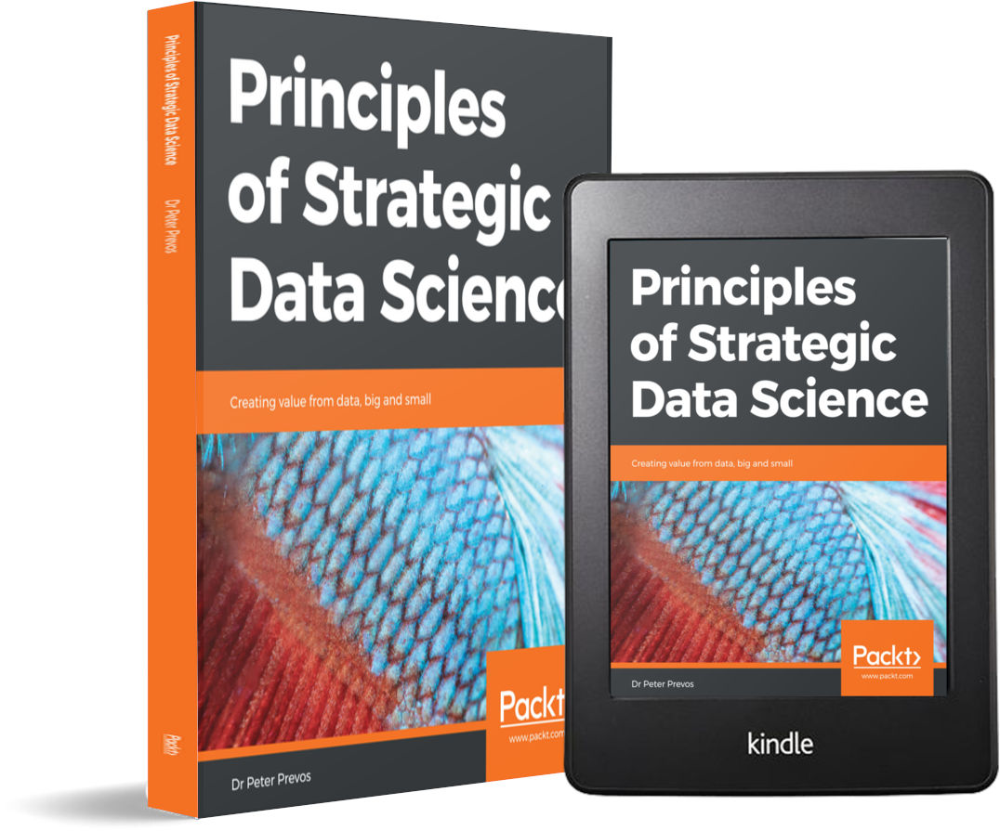
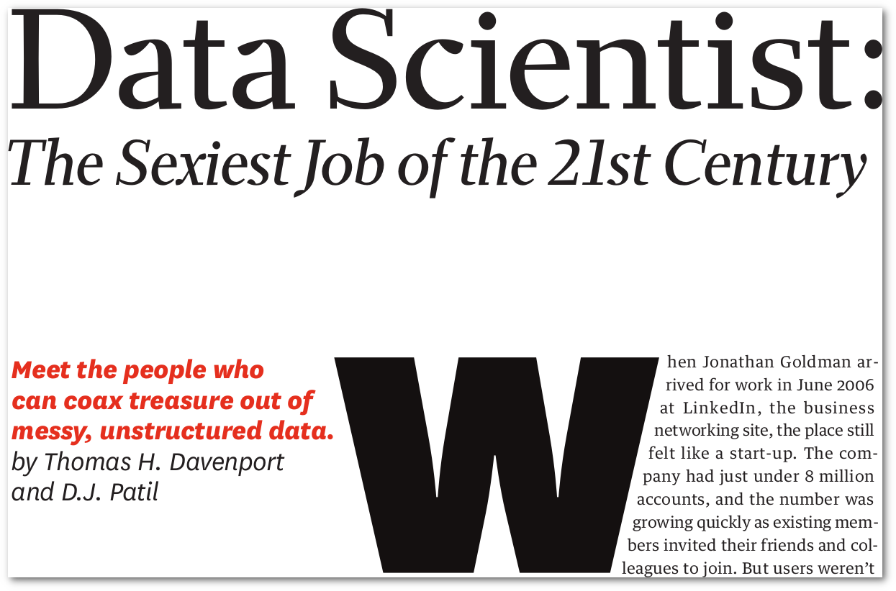
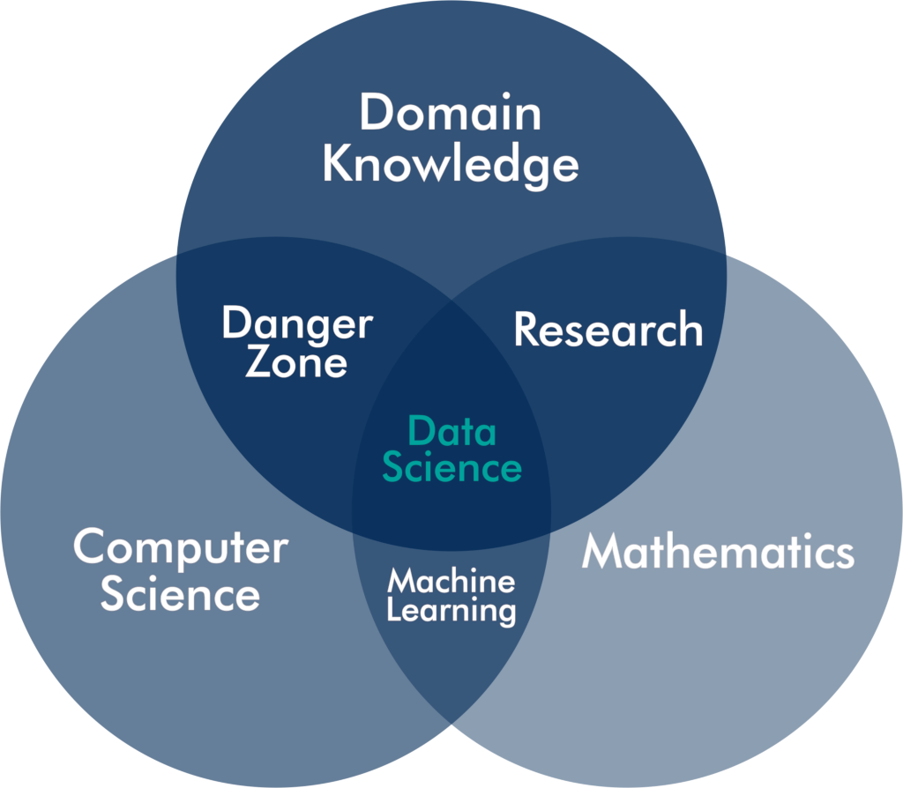
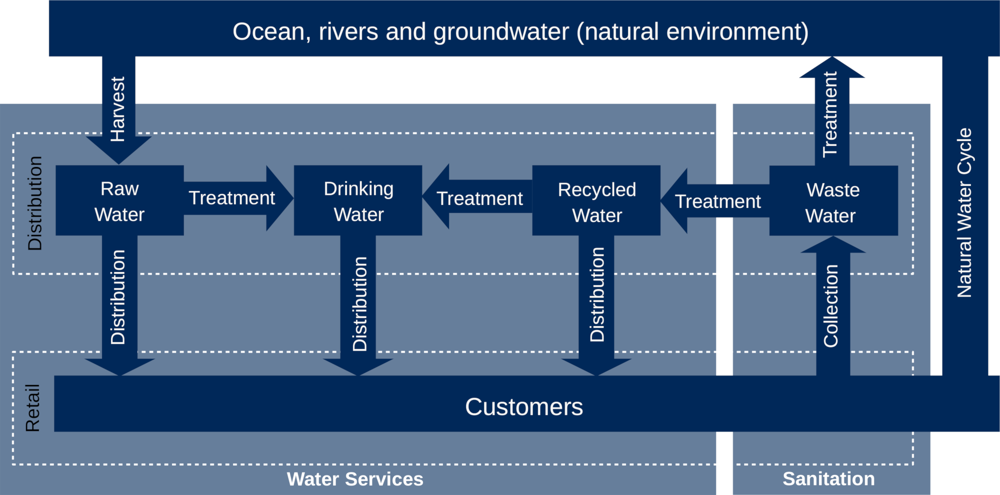
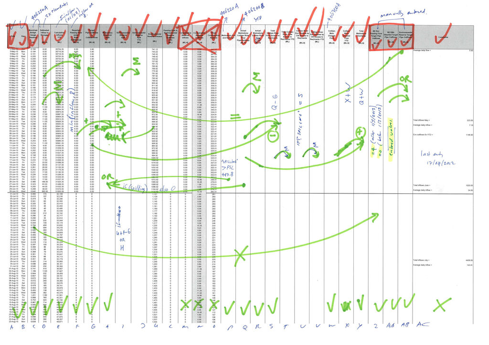
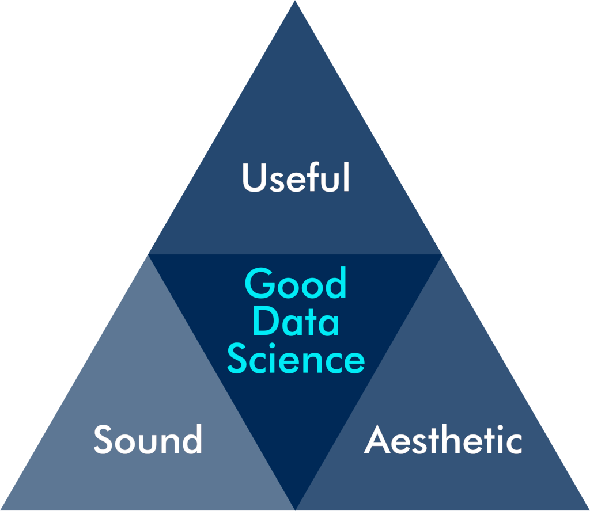
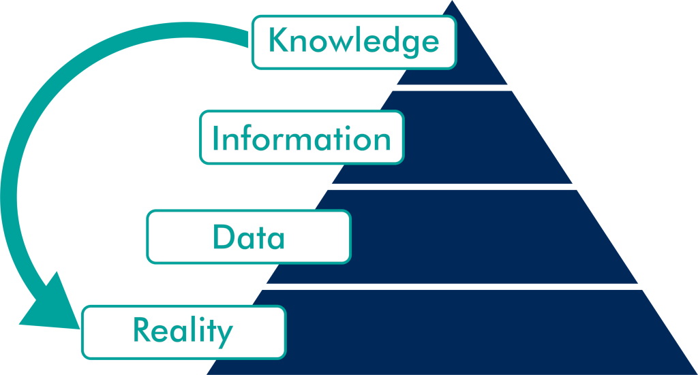
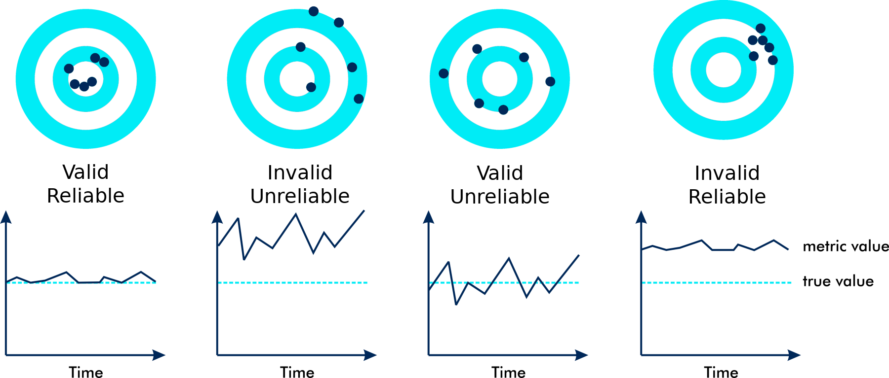

# 2. Principles of Water Utility Data Science {#datascience}

This session provides a framework for best practice in data science. The two sections define data science and how it applies to the water supply value chain.  This framework is explained in more detail in the book _Principles of Strategic Data Science_ by Peter Prevos, available through [Packt Publishing](https://www.packtpub.com/big-data-and-business-intelligence/principles-strategic-data-science).

{width: 60%, align: middle}

This chapter has the following learning objectives:
* Define data science and describe how it differs from traditional analysis.
* Understand the three principles of good data science.
* Give examples of useful data science.

## What is data science?
The idea that data helps us to understand the world is thus almost as old as humanity itself and has gradually evolved into what we now call data science. Using data in organisations is also called business analytics or evidence-based management. There are also specific approaches, such as Six-Sigma, that use statistical analysis to improve business processes.

Although data science is merely a new term for something that has existed for decades, some recent developments have created a watershed between the old and new ways of analysing a business. The difference between traditional business analysis and the new world of data science is threefold.

Firstly, businesses have much more data available than ever before. The move to electronic transactions means that almost every process leaves a digital footprint. Collecting and storing this data has become exponentially cheaper than in the days of pencil and paper. However, many organisations manage this data without maximising the value they extract from it. After the data served its intended purpose, it becomes 'dark data', stored on servers but languishing in obscurity. This data provides opportunities to optimise how an organisation operates by recycling and analysing it to learn about the past to create a better future.

{width: 60%, align: middle}

Secondly, the computing power that is now available in a tablet was not long ago the domain of supercomputers. [Piotr Luszczek](https://www.phoronix.com/scan.php?page=news_item&px=MTE4NjU) showed that an iPad-2 produced in 2012 matched the performance of the world's fastest computer in 1985. The affordability of enormous computing power enables even small organisations to reap the benefits of advanced analytics.

Lastly, sophisticated machine learning algorithms are freely available as Open Source software, and a laptop is all that is needed to implement sophisticated mathematical analyses. The R language for statistical computing and Python are potent tools that can undertake a vast array of data science tasks such as visualisations and machine learning. These languages are 'Swiss army chainsaws' that can tackle any business analysis problem. Part of their power lies in the active communities that support each other in their journey to mastering these languages.

These three changes have caused a revolution in how we create value from data. The barriers to entry for even small organisations to leverage information technology are low. The only hurdle is making sense of the fast-moving developments and following a strategic approach instead of chasing the hype.

This revolution is not only about powerful machine learning algorithms but about a more scientific way of solving problems. The vast majority of analytical issues in supplying water or sewerage services do not require machine learning to solve. The definition of data science in this book is not restricted to machine learning, big data and artificial intelligence. These developments are essential aspects of data science, but they do not define the field.

The expectations of data science are very high. Business authors position data science and its natural partner 'big data', as a panacea for all societal problems and a means to increase business profits. In a 2012 article in *Harvard Business Review*, Davenport and Patil even proclaimed data scientist the "sexiest job of the 21st century" ([Figure 2.2](https://hbr.org/2012/10/data-scientist-the-sexiest-job-of-the-21st-century)). Who would not want to be part of a new profession with such enticing career prospects?

{width: 60%, align: middle}

For organisations that deliver physical products, data science is about improving how they collect, store and analyse data to extract more value from this resource. The objectives of data science are not the data or the analysis itself but the organisation's strategic goals. For a water utility, these objectives are generically maintaining or improving the experience that customers have with their service and minimising the impact on the natural environment. Whatever kind of organisation you are in, the purpose of data science is to assist managers with changing reality to a more desirable state. A data scientist achieves this objective by measuring the current and past states of reality and using mathematical tools to predict a future state.

Data science is a systematic and strategic approach to using data, mathematics and computers to solve practical problems. A data scientist is not a scientist as such who understands the world in generalised terms. The challenges facing data scientists are practical rather than scientific. A data scientist in an organisation is less interested in a generalised solution to a problem but focuses on improving how the organisation achieves its goals. In this sense, a data scientist is not strictly speaking a scientist.

## The Elements of Data Science
The best way to unpack the art and craft of data science is Drew Conway's often-cited Venn diagram cite ([Figure](http://drewconway.com/zia/2013/3/26/the-data-science-venn-diagram 2.3)). Conway defines three competencies that a data scientist or a data science team as a collective need to possess. The diagram positions data science as an interdisciplinary activity with three dimensions: domain knowledge, mathematics and computer science. A data scientist understands the subject matter under consideration in mathematical terms and writes computer code to solve problems.

{width: 60%, alt: "Conway's data science Venn diagram.", align: middle}

### Domain Knowledge
The most vital skill within a data science function is *domain knowledge*. While the results of advanced applied mathematics such as machine learning are impressive, without understanding the reality that these models describe, they are devoid of meaning and can cause more harm than good. Anyone analysing a problem needs to understand the context of the issues and the potential solutions. The subject of data science is not the data itself but the reality this data describes. Data science is about things and people in the real world, not about numbers and algorithms.

A domain expert understands the impact of any confounding variables on the outcomes. An experienced subject-matter expert can quickly perform a sanity check of the process and results of the analysis. Domain knowledge is essential because each area of expertise uses a different paradigm to understand the world.

Each domain of human enquiry or activity has different methodologies to collect and analyse data. For example, analysing objective engineering data follows a different approach to subjective data about people or unstructured data in a text corpus. Therefore, the analyst needs to be familiar with the tools of the trade within the problem domain. The earlier-mentioned example of a graduate professional beating a machine learning expert team with a linear regression shows the importance of domain knowledge.

Domain expertise can also become a source of bias and prevent innovative ways of looking at information. Solutions that are developed through systematic research can contradict long-held beliefs that are sometimes hard to shift. Implementing data science is thus as much a cultural process as it is a scientific one.

### Mathematical Knowledge
The analyst uses mathematical skills to convert data into actionable insights. Mathematics consists of pure mathematics as a science in itself and applied mathematics that helps us to solve problems. The scope of applied mathematics is broad, and data science is opportunistic in choosing the most suitable method. Various types of regression models, graph theory, _k_-means clustering, and decision trees are some of the favourite tools of a data scientist.

Combining subject-matter expertise with mathematical skills is the domain of traditional *research*. Academics are moving towards integrating computer science with their work towards a data science approach to conventional analysis.

Numbers are the foundations of mathematics, and the craft of quantitative science is to describe our analogue reality into a model that we can manipulate to predict the future. Not all mathematical skills are necessarily about numbers but can also revolve around logical relationships between words and concepts. Current numerical methods help us understand relationships between people, the logical structure of a text, and many other aspects beyond traditional quantitative analysis. These types of analysis are outside the scope of this course.

### Computer Science
Not that long ago, organisations collected information in large paper archives. Analysing this information was an arduous task that involved many hours of transcribing information to a format that is useful for analysis.

In the twenty-first century, almost all data is an electronic resource. To create value from this resource, data engineers extract it from a database, combine it with other sources and clean the data before analysts can make sense of it. This requirement implies that a data scientist needs to have computing skills. 

Conway uses the term hacking skills, which many people interpret as unfavourable. Conway is, however, not referring to a hacker in the sense of somebody who nefariously uses computers, but in the original meaning of the word of a developer with creative computing skills. The core competency of a hacker, developer, coder, or whatever other terms might be preferable is algorithmic thinking and understanding the logic of data structures. These competencies are vital in extracting and cleaning data to prepare it for the next step of the data science process.

The importance of hacking skills for a data scientist implies that we should move away from point-and-click systems and spreadsheets and instead write code in a suitable programming language. The flexibility and power of a programming language far exceed the capabilities of graphical user interfaces and leads to reproducible analysis.

The data scientist translates the mathematical interpretation of reality needs to computer code. One factor that spearheaded data science into popularity is that the available toolkit has grown substantially in the past ten years. Open Source computing languages such as R and Python can implement complex algorithms that were previously the domain of specialised software and supercomputers. As a result, open Source software has accelerated innovation in how we analyse data and has placed complex machine learning within reach of anyone willing to make an effort to learn the skills.

Conway defines the *danger zone* as the area where domain knowledge and computing skills combine, without a good grounding in mathematics. Somebody might have sufficient computing skills to be pushing buttons on a business intelligence platform or spreadsheet. The user-friendliness of some analysis platforms can be detrimental to the results because they create the illusion of accuracy. Point-and-click analysis hides the inner workings from the user, creating a black-box result. Although the data might be perfectly structured, valid and reliable, a wrongly-applied analytical method leads to useless outcomes.

### The Unicorn Data Scientist?
The data science literature often cites Conway's diagram. His model helped to define the craft of data science. Other data scientists have proposed more sophisticated models, but they all originate with Conway's basic idea. A quick internet search reveals several variants.

The diagram illustrates that the difference between traditional research skills or business analytics exists in understanding and writing code. On the other hand, a data scientist understands the problem they seek to resolve. They grasp the mathematics to analyse the problem. They possess the computing skills to convert this knowledge into outcomes.

The so-called soft skills seem to be missing from this picture. However, communication, managing people, facilitating change, and other such capabilities are competencies that belong to every professional who works in a complex environment, not just the data scientist.

Some critics of this idea point out that these people are unicorns. Data scientists that possess all these skills are mythical employees that don't exist in the real world. Most data scientists start from either mathematics or computer science, after which it is hard to become a domain expert.

This course starts from the assumption that we can breed unicorns by teaching domain experts how to write code and, where required, enhance their mathematical skills. Teaching water professionals to understand the principles of data science and write code helps an organisation embrace the benefits of the data revolution.

D> Many data scientists have published modifications of this model. Can you think of some other competencies specific to analysing data?

## The Water-Data Value Chain: The Digital Water Utility
The flow of data in a utility follows the flow of the water through the value chain. The water value chain (Figure 2.4) starts and ends in the natural environment. Water utilities extract water from nature, process it in their value chain, and eventually return it to the environment.

Water utilities collect data along the flow path of the water. This data describes the quantity and quality of the water, including wastewater. Water utilities measure water flow as it makes its way from the environment to the consumer and back. The data derived from instrumentation provides an objective view of the status of the water supply chain. 

Customer-centric water utilities also collect data from the perspective of the consumers of the services they supply. This data is, by definition, subjective. Data science for water utilities merges the objective measurements from the field with the subjective perspectives of customers to maximise value to the community overall.

The term 'digital water utility' is often used to describe the situation where the flow of water and customer experience is fully captured with data. Some experts even suggest that digitisation disrupts the business model of water utilities. However, the digital water utility is a distraction because data is not replacing effective water management. No matter how much water utilities digitise, electronics will not meaningfully change the service utilities provide: a reliable supply of drinking water and sewerage services. Water utilities provide a physical service that can be enhanced but not replaced by digitisation.

{width: 80%, alt: "Tap water supply chain.", align: middle}

Digitisation also has limitations. Firstly, data cannot describe everything. Measuring physical processes is only ever a sample of the reality we seek to control. Secondly, the experience of customers is subjective, which requires human insight to understand. These limitations highlight the need for domain expertise to complement skills in mathematics and computing. Relying on data alone without recognising water management's physical and social reality does not add value to a community.

## Data Science Tools
The last decade has seen an explosion of available data science tools. There is no single tool that can do everything. Just like a trades-person uses each tool for a specific activity, so does a data scientist use tools for particular tasks within the workflow.

### Spreadsheets
Spreadsheets are the most common tool to solve data problems. They are a great product that combines storing data, writing and executing code and displaying output. Unfortunately, their versatility is also their Achilles heel. As a result, spreadsheets have limited capabilities and some intrinsic constraints. 

Spreadsheets are straightforward to use, but they are almost impossible to reverse-engineer. The biggest issue with spreadsheets is the reproducibility of the analysis process. We all have had the unpleasant experience of trying to understand how a spreadsheet made by somebody else, or one that you did ages ago, actually functions (Figure 2.5).

{width: 80%, alt: "Reverse-engineering a spreadsheet.", align: middle}

### Business Intelligence Systems
The software market is saturated with point-and-click business intelligence systems, such as [Qlik](https://www.qlik.com/), [Tableau](https://www.tableau.com/) or Microsoft [Power BI](https://powerbi.microsoft.com/). These tools are user-friendly portals for end-users to consume data. Business intelligence tools are, however, not an ideal tool to analyse data. Their main strength is to present the analysis results without providing access to the underlying steps and statistics.

Another limitation of these systems is that they only produce visualisations without any meaningful capacity to include a narrative. Business intelligence tools are almost like a 'choose your own adventure'. The user can choose how the system presents the data and thus create their owns stories. While a well-designed visualisation is, as they say, worth a thousand words, the complexity of the analytical process often needs a narrative to help the reader understand the purpose, method and conclusions. Limiting a data product to visualisations creates appealing visuals, but the narrative is lacking.

### Data science code
Writing computer code has long been the domain of information technology professionals. Unfortunately, stereotypes of coders as slightly eccentric geeks who prefer to communicate with their terminal instead of people solidify this view. The main objective of this course is to dispel this false idea and promote that water professionals should ditch their spreadsheets and learn how to write code.

The jump to writing code is not as massive as it might seem for those who develop spreadsheets. Every formula in a spreadsheet is, in essence, a part of a computer program.

There are almost as many computer languages as there are human ones. Many of these languages are suitable to analyse data, and the list in this section only includes the most common ones. Some languages, such as Python, C or Java, are general programming languages that can create any software. Other languages are explicitly developed to manipulate and analyse data.

The Structured Query Language (SQL, pronounced sequel) is a language to access and manipulate databases. Many varieties of SQL exist, but they all have many similarities. The main strength of SQL is its ability to extract, transform and load data. The first version of this robust data interface was released in 1986. Unfortunately, this language is not very good at analysing data because it does not include any higher-order mathematics.

Python is a general-purpose programming language that developers use to develop many types of applications. Python has many extensions with data science functionality. Some people are passionate about using either Python or R. Both languages have their strengths and weaknesses, and complex data science projects combine these languages.

Many other less-known data science programming languages exist, such as Julia, Haskell, Fortran, and Mathematica.

This course uses the R language because it is designed to analyse data. The basic functionality of R includes many higher-order functions to undertake statistical analysis. The RStudio development environment provides a potent tool for analysing data and presenting the results.

## Good Data Science
The question that arises from this introduction is how to manage and analyse data to become a valuable resource. These final sections present a normative model to create value from data using three basic principles derived from architecture. 

This model is helpful for data scientists as an internal check to ensure that their activities maximise value. In addition, managers can use this model to assess the outcomes of a data science project without understanding the mathematical intricacies of the craft and science of analysis.

The three case studies of this course implement these principles so that participants not only learn R syntax but also best practice in analysing data.

### Data Science Trivium
Although data science is a quintessential twenty-first-century activity, we can find inspiration in a Roman architect and engineer, who lived two thousand years ago, to define good data science. Vitruvius wrote his books *About Architecture*, which inspired Leonardo da Vinci to draw his famous Vitruvian man. Vitruvius wrote that an ideal building must exhibit three qualities: *utilitas*, *firmitas* and *venustas*, or usefulness, soundness and aesthetics.

Buildings must have utility so people can use them for their intended purpose. A house needs to be functional and comfortable, and everybody in a  theatre needs to see the stage. Each type of building has specific functional requirements. Secondly, buildings must be sound in that they are firm enough to withstand the forces that act upon them. Last but not least, buildings need to be aesthetic. In the words of Vitruvius, buildings need to look like Venus, the Roman goddess of beauty and seduction.

The Vitruvian rules for architecture can also define good data science. Excellent data science needs to have utility; it needs to be helpful to create value. The analysis should be sound so it can be trusted. Data science products also need to be aesthetic to maximise the value they provide to an organisation (Figure 2.6).

{width: 60%, alt: "Principles of good data science.", align: middle}

### Useful Data Science
Whether something is useful is a subjective measure. What is useful to one, might be detrimental or useless to somebody else. Data science is a business or social activity, so usefulness is the extent to which something contributes to their strategic or operational objectives. If a data science project is unable to meet this criterion, then it is strictly speaking useless. 

After digesting a research report or viewing a visualisation, managers ask themselves: "What do I do differently today?" Therefore, usefulness in data science depends on the ability of the results to empower professionals to influence reality positively. In other words, the conclusions of data science either comfort management that objectives have been met or provide actionable insights to resolve existing problems or prevent future ones.

As a civil engineer and social scientist, I could spend many hours analysing the vast amounts of data collected by my organisation. Although dredging the data to find something of value might be an exciting way to waste time, there is also a significant risk of finding fool's gold instead of valuable nuggets of wisdom. Therefore, the first step that anyone working with data should undertake before starting a project is to define the business problem that needs solving.

For data science to provide actionable intelligence, the raw data must be converted to knowledge following a standardised workflow. The well-known DIKW Pyramid (Data, Information, Knowledge and Wisdom) explains how data produces a useful analysis. Various versions of the model have been proposed, with slightly different terminology and interpretations.

The version in this book is modified to understand better how to create useful data science (Figure 2.7). Firstly, wisdom no longer forms part of the model because this concept is too nebulous to be helpful. Anyone seeking wisdom should study philosophy or practice religion as data science is unable to provide this need. 

Secondly, the bottom of the pyramid needs to be grounded in reality. The standard DIKW model ignores the reality from which the data is collected that creates the information and knowledge used to make business decisions. 

The third modification to the traditional model is a feedback loop from knowledge to the real world. Data science aims to enhance the knowledge that professionals use to influence reality by converting data into information.

Anchoring the model for useful data science to reality emphasises the importance of domain knowledge when analysing data. In addition, subject-matter expertise helps to contextualise abstract data, resulting in better outcomes.

{width: 60%, alt: "Reality, Data, Information, Knowledge Pyramid.", align: middle}

### Reality
Useful data science positively influences reality by collecting data, creating information and increasing our knowledge about and understanding reality. This knowledge is valuable when it changes how we perceive reality to innovate the way we do things and enables better operational or strategic decisions. When data science is independent of the world, it seeks to understand or influence; it loses its power to be valuable.

This reality of data science can be either physical or social, each of which requires a different paradigm to describe the world. Our physical reality can be measured with almost arbitrary precision. We can measure size, weight, chemical composition, time, and other physical entities, with high validity and reliability.

Numbers can summarise the social world, but measurements of how people feel and think are indirect observations. We cannot read people's minds. When we want to know how somebody feels about a level of service or another psychological parameter, we can only indirectly measure this variable. Data from the social world is often qualitative and requires different considerations than in the physical world.

The complicated relationship between the data and the reality it seeks to improve emphasises the need for subject-matter expertise about the problem under consideration. Data should never be seen as merely an abstract series of numbers or a corpus of text and images but should always be interpreted in its context to do justice to the reality it describes.

This course stays close to the reality of urban water management through realistic case studies about water quality, customer perception and water consumption.

### Data
Data is the main ingredient of data science, but not all data sources provide the same opportunities to create useful data products. The quality and quantity of the data determine its value to the organisation. This mechanism is just another way of stating the classic *Garbage-In-Garbage-Out* (GIGO) principle. 

This principle derives from the fact that computers blindly follow instructions, irrespective of truthfulness, usefulness or ethical consequences of the outcomes. Thus, an excellent algorithm with low quality or insufficient data cannot deliver value to an organisation. On the other hand, analysing high-quality data with an invalid algorithm result in 'garbage' instead of valuable information.

The quality of data relates to the measurement processes used to collect the information and its relationship to the reality it describes. The quality of the data and the outcome of the analysis is expressed in their validity and reliability.

The next step is to decide how much data to collect. Determining the appropriate amount of data is a balancing act between the cost of collecting, storing and analysing the data versus the potential usefulness of the outcome. In some instances collecting the required data can be more costly than the benefits it provides.

One guideline to determine what and how often to collect is to work backwards from the sought benefits. Following the knowledge pyramid, we should collect data that enables us to influence reality positively. The frequency of collection is an outcome of the statistical power required to achieve the desired objectives. In most cases, the more data is available, the higher the statistical power of the analysis.

The amount of data points required to achieve a specific outcome also depends on the type of data. The more reliable and valid the measurements, the fewer data points are needed to obtain a reliable sample. Lastly, the need to ensure that a sample represents the population it describes defines the minimum size of the sample in a social context. Determining sample sizes is a complex topic, and the statistics literature provides detailed information about how much data to collect to achieve the required statistical power.

Gathering data about people because it might be useful in the future also has ethical consequences. Storing large amounts of personal data without a defined need can be considered unethical because the data might be used for a purpose for which the subjects did not consent. Medical records are a case in point. They are collected to manage our health and not for insurance companies to maximise their profits.

### Information
Within the context of this book, information is defined as processed data. Thus, information is data placed with the context of the reality from which it was extracted. To ensure information is sound and useful, professionals need to use an appropriate methodology, logically present the information, and preserve future reuse or review results.

Data scientists use an extensive range of methods to convert data into information. At the lowest level, summarising the averages of the various data points converts provides some value. More sophisticated analysis transforms data about the past into a prediction of the future. These techniques require a solid understanding of mathematics and analytical methods to ensure they don't result in data pseudo data science.

Communicating information is where art meets data science. Writing useful reports and designing meaningful visualisations ensures that a data product is valuable.

### Knowledge
Professionals with subject-matter expertise gain knowledge from data science results, which they use to decide on future courses of action. Knowledge can be either implicit or explicit. The outcome of a data science project, also known as a data product, is explicit knowledge, which can be transferred through writing or instruction.

Numbers and visualisations help professionals to understand the reality they need to manage. This process of understanding and using these results in practice leads to tacit knowledge, which is the essence of domain expertise. However, tacit knowledge is difficult to transfer because it combines learnt explicit knowledge mediated through practical experience.

Data science thus not only requires domain expertise to be useful, but it can also increase this expertise. This topic is outside the scope of data science as it ventures into knowledge management.

### Feedback Loop
The last and most important part of this data science framework is the feedback loop from knowledge back to reality. The arrow signifies actionable intelligence, which is how reality is improved through knowledge. The key message of this section is that the results of data science need to either lead to a different way of thinking about a problem or provide actionable intelligence to propose.

Either option eventually leads to improved decisions using the best available data and analysis. Care needs to be taken, however, that the correct conclusions are drawn. The GIGO principle only covers the process's input, but the process itself needs to be sound. Although the data might be of good quality, a lousy analysis still result in 'garbage'. The following two sections discuss how we can ascertain whether data science outcomes are sound and ensure the user draws the correct conclusion from the information.

### Sound Data Science
Just like a building should be sound and not collapse, a data product needs to be sound to create business value. Soundness is where the science and the data meet. The soundness of a data product is defined by the validity and reliability of the analysis, which are well-established scientific principles (Figure 2.8).  The soundness of data science also requires that the results are reproducible. Lastly, the data and the process of creating data products need good governance to assure beneficial outcomes.

The distinguishing difference between traditional business analysis and data science is the systematic approach to solving problems. The keyword in the term data science is thus not data but *science*. Data science is only useful when the data answers a helpful question, which is the science part of the process.

{width: 80%, alt: "Validity and reliability of data and analysis.", align: middle}

#### Reliability
The reliability or accuracy of physical measurements depends on the quality of the instrumentation used to obtain the data. Engineers spend much effort to assure the reliability of instrumentation through maintenance and calibration programs. In addition, the instruments need to be installed and maintained to the manufacturer's specifications to ensure their ongoing accuracy. Quality assurance of instrumentation is possibly the most costly aspect of collecting and storing data about physical processes.

Several methods exist to test the reliability of psychological survey data. One simple test is to check for respondents that provide the same answer to all questions. The chances that somebody would genuinely answer "Neither agree nor disagree" to all items is negligible, and it is good practice to remove these people from the sample. Researchers also use questions to trap fake responses. The researcher can, for example, ask people whether they agree or disagree with certain factual statements, such as: "You live in Australia." Any subject not wholly agreeing with this question (assuming this is an Australian survey) should be removed from the sample.

#### Validity
The validity of a data set and the information derived from it relates to the extent to which the data matches the reality it describes. Therefore, the validity of data and information depends on how this information was collected and how it was analysed.

For physical measurements, validity relates to the technology used to measure the world and is determined by physics or chemistry. If, for example, our variable of interest is temperature, we use the fact that materials expand, or their electrical resistance increases, when the temperature rises. Measuring length relies on comparing it with a calibrated unit or the time it takes light to travel in a vacuum. Each type of physical measurement uses a physical or chemical process, and the laws of nature define validity. When measuring pH, for example, we want to be sure that we measure the power of hydrogen ions and not some other chemical property.

Mental processes, such as customer satisfaction or personality, are much more complex to measure than physical properties. Although a state of mind is merely a pattern of electrical and chemical activity in the brain, no technology can directly measure it. As a result, not much is known about the relationship between the physical events in our mind and our feelings, motivations and other psychological states.

Not all data about people has a validity problem. Observations that relate directly to our behaviours, such as technology that tracks our movements, or eye-tracking equipment to record our gaze, are physical measurements. Demographic data is a direct measurement of a social variable. However, even seemingly simple aspects such as gender can significantly reduce complexity when trying to measure it. What often seems a simple demographic variable can be quite complicated to define.

Reliability and validity are further discussed in [chapter 10](#survey) where we analyse the results of a customer survey.

#### Reproducibility
The third aspect of the soundness of a data product is its reproducibility, which is the ability for other people to reconstruct the analyst's workflow from raw data collection to reporting. This requirement is a distinguishing factor between traditional business analysis and data science. 

The condition of reproducibility ensures that managers who base business decisions on a data product can review how the results were obtained. Reproducible analysis engenders trust in the results because they are potentially auditable. Reproducibility ensures that peers can evaluate all analysis and negates the problems of black boxes.

Reproducibility is the major topic of the mini hackathons at the end the case studies. In [chapter 7](#dataproducts), we write code to generate a PowerPoint presentation linked to data. In [chapter 11](#reporting), the task is to write code that produces a MS Word report, linked to data. This approach is called literate programming, which is becoming the norm in scientific writing.

#### Governance
The fourth aspect of sound data science is governance. The process of creating data products needs to be documented in line with quality assurance principles. Practical considerations, such as naming conventions for scripts and coding standards to ensure readability, are a necessary evil when managing complex data science projects.

The same principle also applies to managing data. Each data source in an organisation needs to have an owner and a custodian. These are people who understand the relationship between this data and the reality from which it is extracted. Large organisations have formal processes that ensure each data set is governed and that all employees use a single source of truth to safeguard the soundness of data products.

Governance is a double-edged sword as it can become the 'wet blanket' of an organisation. When governance becomes too strict, it smothers the very innovation that data science is expected to deliver. The art of managing a data science team is to find a middle way between strictly following the process and allowing for deviations of the norm to foster innovation. Good governance minimises risk while at the same time enabling positive deviance that leads to better outcomes.

### Aesthetic Data Science
Vitruvius insisted that buildings, or any other structure, should be beautiful. The aesthetics of a building causes more than just a pleasant feeling. Architecturally designed places stimulate our thinking, increase our well-being, improve our productivity and stimulate creativity.

While it is evident that buildings need to be pleasing to the eye, the aesthetics of data products might not be so obvious. The requirement for aesthetic data science is not a call for beautification and obfuscation of the ugly details of the results. The process of cleaning and analysing data is inherently complex. Presenting the results of this process is a form of storytelling that reduces this complexity to ensure that a data product is understandable.

The data science value chain starts with reality, described by data. Next, this data is converted to knowledge, which managers use to influence reality to meet their objectives. This chain from reality to human knowledge contains four transformations, each with opportunities for a loss of validity and reliability. The last step in the value chain requires the user of data science results to interpret the information to draw the correct conclusion about their future course of action. Reproducibility is one of the tools to minimise the chance of misinterpretation of analyses. Another mechanism to ensure proper interpretation is to produce aesthetic data science.

Aesthetic data science is about creating a data product, which can be a visualisation or a report designed so that the user draws correct conclusions. A messy graph or an incomprehensible report limits the value that can be extracted from the information.

[Chapter 6](#ggplot) delves deeper into a model for aesthetic data science and shows how to tell stories with data using the ggplot library.

## Best-Practice Data Science with R
The three case studies in this course don't just discuss writing code but also delve deeper into these data science principles. Each case study refers back to the principles of good data science to ensure that analysis is useful, sound and aesthetic.

Each case study starts with a problem definition that explains the issue that needs resolution. Starting analysis with a problem statement is critical to ensure that our work is useful and delivers value. Each case study also includes a description of the reality from which the data was extracted. Understanding the context of abstract data minimises mistakes in interpretation.

## Further Study
If you like to delve a little deeper into the theory of strategic data science then please consider the following books:

* Caffo, Brian, Roger Peng, and Jeffrey T. Leek. _Executive Data Science. A Guide to Training and Managing the Best Data Scientists_. [LeanPub](https://leanpub.com/eds), 2018.
* Peng, Roger D., and Elizabeth Matsui. _The Art of Data Science. A Guide for Anyone Who Works with Data_. [LeanPub](https://leanpub.com/artofdatascience), 2016.
* Prevos, Peter. _Principles of Strategic Data Science_. [Packt](https://www.amazon.com/Principles-Strategic-Data-Science-Creating/dp/1838985298), 2019.

The [next chapter](#basics) starts to put these principles into practice and introduces the R language basics and RStudio.
