# 6. Visualising Data with ggplot {#ggplot}
The old cliche that a picture speaks more than a thousand words most certainly applies to data science. A simple graph can summarise thousands of numbers and make them understandable in the blink of an eye. Looking at tables filled with numbers requires a lot of effort to interpret and the reader might not draw the same conclusion as you.

The internet is awash with infographics and other creative methods to create images from data. However, not all data visualisations are created equal. Some graphics are hard to interpret, which can lead to wrong decisions. Others confuse or even deceive the reader. Scientists have studied in great depth how the mind perceives graphics and devised a comprehensive body of knowledge that helps us to create sound, useful and aesthetic visualisations.

This chapter introduces some principles of best practice in data visualisation. The second part presents the ggplot2 library and some basic techniques to create high-quality graphics. The learning objectives for this chapter are:

* Apply principles of best practice in visualisation.
* Understand the principles of the Grammar of Graphics.
* Visualise water quality data with the ggplot2 library.

The data and code for this session are available in the `chapter_06.R` file in the `casestudy1` folder of your RStudio project.

{width: 60%, align: "center"}


## Principles of Visualisation
In the [first chapter](#datascience) of this course, we saw how the principles of good data visualisation align with the art of architecture. Although visualising data has some parallels with art, it is a very different craft. 

All works of art are a form of deception. An artist paints a three-dimensional world on a flat canvas, and although we see people, we are just looking at blobs of paint. Data visualisation as an art form needs to be truthful and not deceive. The purpose of any graph is to reliably reflect the data, without leaving room for the viewer the interpret the scene.  Following some basic rules prevents confusing the consumers of your data products. 

Firstly, visualisation needs to have a simple narrative. The reader should be able to draw the intended conclusion without too much metal effort. A graphic should only tell one story, such as comparing numbers, showing a trend and so on.

Secondly, visualisations should minimalist, removing elements that don't add to the story. Graphs with too many line or colours confuse the reader and increase the difficulty of interpreting the information.

Beauty is in the eye of the beholder, and there are no formulas or algorithms to ensure perfect visualisations. The social network Reddit has two groups dedicated to visualisations. Users members of the [Data is Ugly](https://reddit.com/r/dataisugly/) and [Data is Beautiful](https://reddit.com/r/dataisbeautiful/) groups share images of visualisations they consider ugly or beautiful. 

These two groups sometimes share the same visualisations because of different interpretations of aesthetics in data. What is a beautiful plot to one person, is an abomination to somebody else. The aesthetics of data visualisation is for a significant part in the eye of the beholder. However, when viewing aesthetics from a practical perspective, we can define what this means with a simple heuristic.

### The aesthetics of visualising data
Data visualisations are everywhere. They are no longer the domain of scientific publications and business reports. Publications in every medium use graphs to tell stories. The internet is awash with infographics on a wide range of topics. These popular images are often data science porn because they are designed to entertain and titillate, with limited usability from a business perspective. They are a fantastic tool to supply information to customers but should not be used to report data science. Aesthetics in data science is not about creating works of art but about producing images that are useful from a business perspective.

Some data visualisations in engineering remind me of a [Jackson Pollock](https://en.wikipedia.org/wiki/Jackson_Pollock) painting (Figure 6.1). Engineers love to maximise the number of visual elements in a graph, with lines and colours splashed across the screen. Adding too much information to a chart and using too many colours reduces its usability. When visualisation is not aesthetic, it becomes harder to interpret, which leads to the wrong conclusions and can even deceive the user.

{width: 70%, alt: "Jackson Pollock, Blue Poles number 11.", align: "center"}


Perhaps a good data visualisation should look more like a painting by [Piet Mondrian](https://en.wikipedia.org/wiki/Piet_Mondrian) who is famous for his austere compositions with straight lines and primary colours (Figure 6.2). Using art to explain data visualisation is not an accidental metaphor because visual art represents how the artist perceives reality. This comparison between Pollock and Mondrian is not a judgement of their artistic abilities. For Pollock, reality was chaotic and messy, while Mondrian saw a geometric order behind the perceived world.

{width: 50%, alt: "Piet Mondrian, Composition in Red, Yellow and Blue.", align: "center"}


Edward Tufte is an American statistician who is famous for his work on visualisation. Tufte introduced the concept of the data-ink ratio. In simple terms, this ratio expresses the relationship between the ink on the paper that tells a story, and the total amount of ink on the paper. Tufte argues that this ratio should be as close to one as possible. In other words, we should not use any graphical elements that don't communicate any information, such as background images, redundant lines and text.

Now that we are in the paperless era, we can use the data-pixel ratio as a generic measure for the aesthetics of visualisations. The principle is the same as in the analogue days. Unnecessary lines, multiple colours or multiple narratives risk confusing the user of the report.

The data-pixel ratio is not a mathematical concept that needs to be expressed in exact numbers. The ratio is a guideline for designers of visualisations to help them decide what to include and, more importantly, what to exclude from an image.

Figure 6.3 shows an example of maximising the data-ink ratio. The bar chart on the left has a meagre data-pixel ratio. The background image of a cat might be cute and possibly even related to the topic of the visualisation, but it only distracts from the message. Using colours to identify the variables is unnecessary because the labels are at the bottom of the graph. The legend is not very functional because it also duplicates the labels. Lastly, the lines around the bars have no function.

{width: 60%, align: "center"}
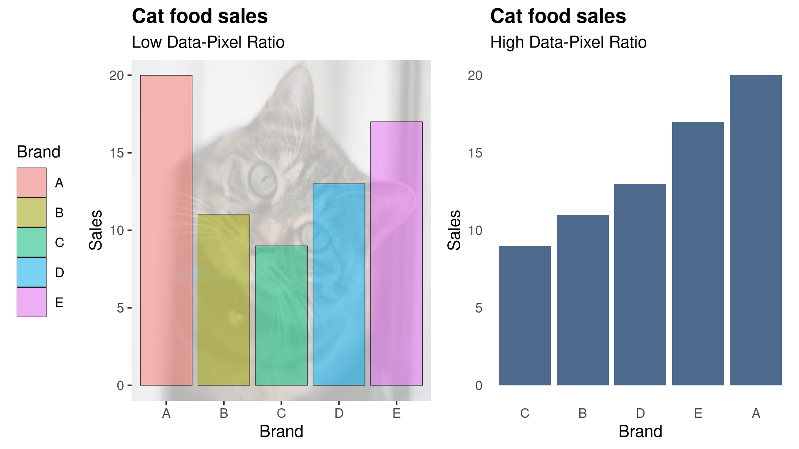

In the improved version, all unnecessary graphical elements have been removed. Assuming that the story of this graph is to compare variables, the columns have been ranked from large to small. If the narrative of this graph was to compare one or more of the variables with other variables, then groups of bars can be coloured to indicate the categories.

The basic rule of visually communicating data is to not 'pimp' your visualisations with unnecessary graphical elements or text that does not add to the story. When visualising data, austerity is best-practice.

### Telling Stories
First and foremost, visualisations need to tell a story. The story in graph should not be a mystery novel. A visualisation should not leave the viewer in suspense but get straight to the point. Trying to squeeze too much information into one graph confuses the reader. Ideally, each visualisation should contain only one or two narratives. It is better to create multiple charts than to combine everything you want to visualise in one image.

Numerical data can contain several types of narratives. A graph can compare data points to show a trend among items or communicate differences between them. Bar charts are the best option to compare data points with each other. A line graph is possibly your best option to compare data points over time. The distribution of data points is best visualised using a histogram. Scatter plots or bubble charts show relationships between two or three variables (Figure 6.4).

{width: 100%, align: "center"}
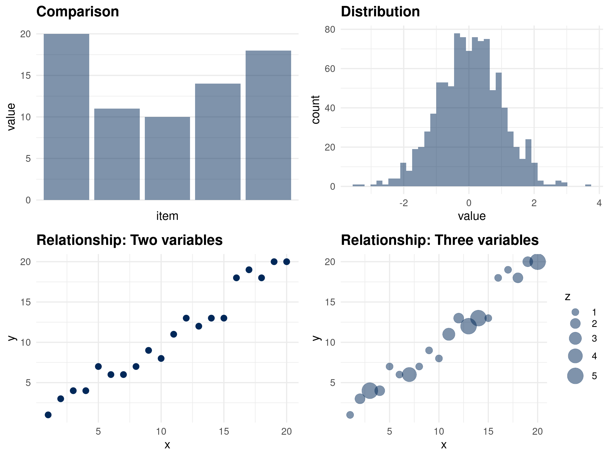

Every visualisation needs to tell a story and not just summarise a bunch of numbers. The detailed considerations of choosing the most suitable visualisation are outside the scope of this course. The internet contains many tools to help you with this choice. [Andrew Abela](https://extremepresentation.typepad.com/blog/2008/06/visualization-taxonomies.html) developed one of the earliest examples of a tool to choose the most suitable visualisation. The [R Graph Gallery](https://www.r-graph-gallery.com/) provides some guidance on the methods available in R.

D> Go to the [Data is Ugly](https://www.reddit.com/r/dataisugly/) subreddit and select one of the many visualisations they share. Go to the [discussion forum](https://community.leanpub.com/c/r4h2o) and explain why you believe that this one you chose is particularly 'ugly'.

## Visualising data with ggplot
The Tidyverse set of packages contains ggplot2, one of the most powerful data visualisation tools. This package follows a layered approach to visualising data, which simplifies the process of producing sophisticated graphics. This session introduces the basics of *ggplot2* using the Gormsey water quality data from the first case study.

The ggplot2 library applies the grammar of graphics developed by Leland Wilkinson. This grammar is an approach to systematically develop visualisations in logical layers (Figure 6.5). 

{width: 40%, align: "center"}
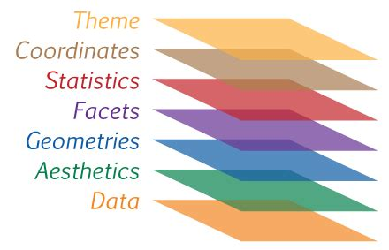

The data exists at the lowest level, without which there is nothing to visualise. The aesthetics define which variables of the graph are visualised. These are generally the axes and any colouring or shapes of the geometries. The geometries are elements that represent the data, such as bars, pies or lines.

Many visualisations contain a lot of information, which can lead to confusing images with many lines. Facets are a way to create a grid of your visualisation that separates the geometries for easy comparison. The statistics relate to any specific transformations to summarise the data, such as trend lines. 

Lastly, each graph has a coordinate system and a theme that defines background colours, fonts and so on.

The ggplot functions use this vocabulary and layered approach to build visualisations. The next section shows various examples using Gormsey water quality data.

{width: 60%, align: "center"}


### Aesthetics
The primary `ggplot()` function starts with the name of the variable that holds the data, followed by the aesthetics. The aesthetics consist of the fields used to visualise the data. The example below plots the `gormsey` data frame and uses the `Town` variable.

{format: r, line-numbers: false}
```
library(tidyverse)
gormsey <- read_csv("casestudy1/gormsey.csv")

ggplot(gormsey)

ggplot(gormsey, aes(Town))
```

Evaluating the first ggplot function call results in an empty canvas. When we add the aesthetics, ggplot draws a canvas with a spot for each the eleven towns on the x-axis.

{width: 100%, align: "center"}
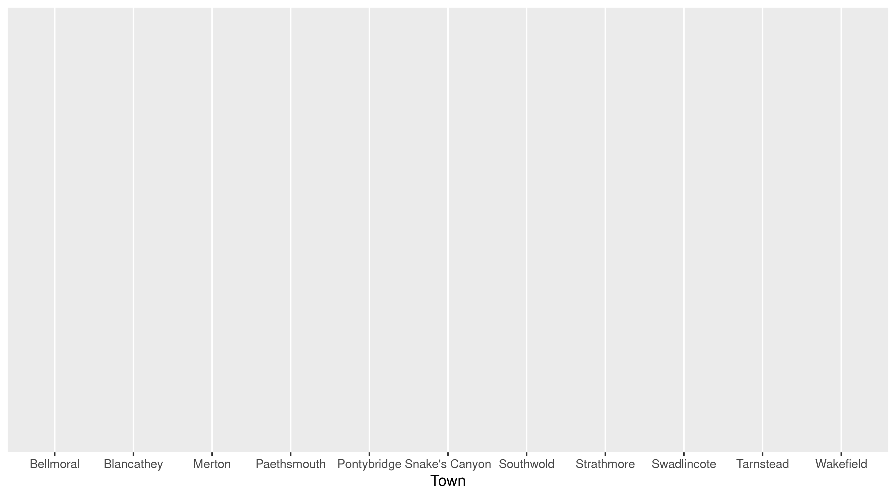


### Geometries
To visualise the towns, we need to add a geometry. Given that the town name is a qualitative variable, the only thing we can visualise for this data is to count the number of samples in each town. The `geom_bar()` function counts the number of occurrences of each zone and plots them as a bar chart (Figure 6.6).

{format: r, line-numbers: false}
```
ggplot(turbidity, aes(Zone)) + 
    geom_bar()
```

In ggplot, the layers are connected with a `+` sign. In computer science terminology, the plus sign is a pipe, which means that the result from the code before the symbol is moved (piped) to the next section.

It is common practice to start a new line after each layer to create readable code. RStudio automatically indents the code so that you know which lines belong together. If your code becomes messy, then you can use `Crtl-i` to align the text.

If we don't write anything between the parenthesis, then ggplot will create a simple chart. The `ggplot()` function passes the variable in the aesthetics to the bar chart geometry. It then counts the number of elements for each category in the Measure variable (Figure 6.7).

{width: 100%, align: "center"}
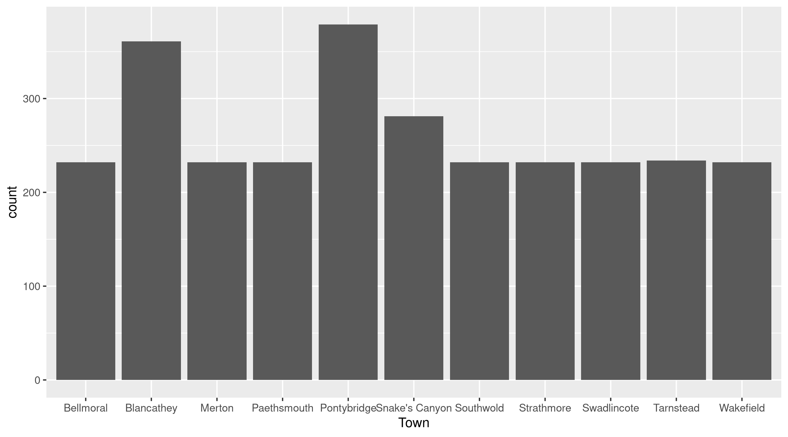

This function creates a simple grey plot. The paradigm of maximising the data-pixel ratio suggests that colour should be used sparingly. As a general rule, only use multiple colours when they express a variable. 

You also add colour to expresses data to comply with a style guide. You add colour by using `geom_bar(fill = "blue")`, or any other colour you might fancy. 

All the primary colours, such as red, green and blue, and many more subtle shades can be named. The [University of Columbia](http://www.stat.columbia.edu/~tzheng/files/Rcolor.pdf) hosts a useful PDF document with a list of the available colours. Which one is your favourite?

R also understands colour colours in HTML [hex codes](https://www.w3schools.com/colors/colors_picker.asp). These codes consist of three hexadecimal numbers (ranging from 00 (0) to FF (255)) for red, green and blue. The hex code `#FF0000` results in a purely red colour, `#00FF00` is green and `#78417A` is a deep purple.

X> Add your favourite colour to the bar plot.

The aesthetics option can also add colour to visualise another variable. The example below creates a time series chart of the turbidity results in Gormsey. The `col = Town` part in the aesthetics instructs ggplot to draw a line for each town and give it a separate colour (figure 6.9).

{format: r, line-numbers: false}
```
turbidity <- filter(gormsey, Measure == "Turbidity")
ggplot(turbidity, aes(Date, Result, col = Town)) + 
    geom_line()
```

{width: 100%, align: "center"}
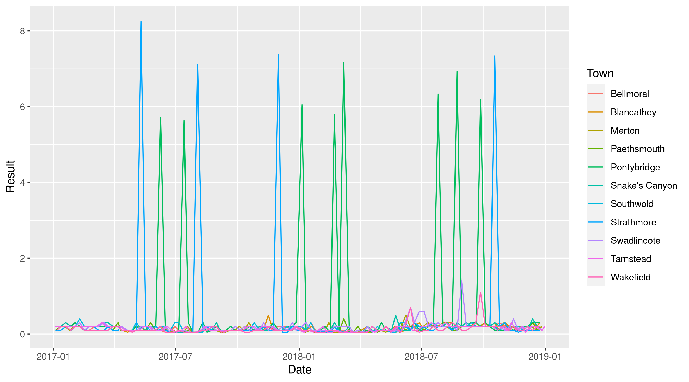

This example is not an optimal use of this functionality because there are too many lines, which are hard to read. Referring back to the visual arts, this graph is a bit like a Jackson Pollock action painting. We will fix this when we discuss facets. 

The minimum amount of colours depends on the narrative you want to convey and the type of visualisation. Cartography often uses colour to communicate its message. 

One of the problems that plagued mathematicians for centuries is how many colours we need as a minimum to colour every area on a map, without two bordering regions with the same colour (excluding the background colour). Cartographers have known for centuries from practical experience that this number is four. Mathematicians were only able to prove this rule a few decades ago.

Besides minimising the number of colours, we also need to know which colours to use. Cartographers Mark Harrower and Cynthia Brewer developed the Color Brewer system ([colorbrewer2.org](http://colorbrewer2.org/)) to help designers of visualisations select a useful scheme. These colour schemes are designed for choropleth maps, but can also be used for non-spatial visualisations. The Color Brewer system consists of three types of colour palettes: sequential, diverging and qualitative (Figure 6.8). 

{width: 40%, align: "center"}
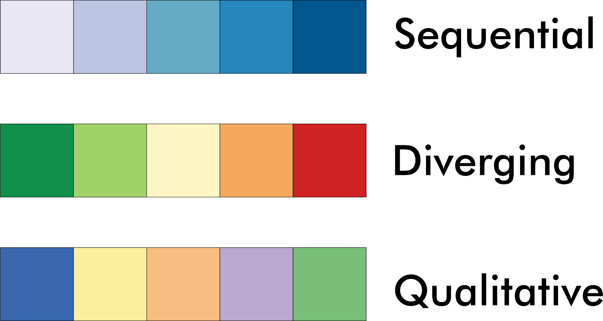

Sequential schemes contain a series of colours with increasing strength. These colour schemes are most suitable to visualise magnitude from low to high, with light colours usually for low data values and dark colours for high values.

Diverging colours are used to visualise a deviation from a norm, such as droughts or floods or adherence to a budget. Green, yellow and red are the most common use of this type of palette as business reports are filled with traffic lights to report progress. This type of reporting helps managers to focus on problem areas so they can discuss actions to improve future performance. 

A note of caution is that this technique does not work for men with green/red colour blindness. This condition is not a problem with real traffic lights as the order of the lights is always the same. However, on a business report, the colours will all look the same to roughly eight per cent of men with this condition.

Qualitative colours are groups of colours that are aesthetically compatible but without a logical relationship between them based on the data. These palettes can express qualitative values such as categories. 

Q> Which colour scheme is used in the line chart in figure 6.9?

The R language has many packages that define specific colour pallets. Emil Hvitfeldt has curated a collection of hundreds of [R colour palettes](https://github.com/EmilHvitfeldt/r-color-palettes) to use in your visualisations.

The ggplot2 library provides many geometries that can be used to visualise the data. The [ggplot2 website](https://ggplot2.tidyverse.org/) has detailed descriptions of each of the other available geometries.  As mentioned previously, these geometries need to be chosen, so they tell the story you want to convey to the data user.

We have already seen the `geom_bar()` which counts qualitative variables and visualises them in a bar plot. The `geom_col()` geometry plots the values, just like a line geometry. Column charts are best when we want to visualise a discontinuous time series, such as daily water volumes. Columns are better because drawing a line implies that we can interpolate between measured values.

Box plots are a useful geometry to communicate the distribution of results (Figure 6.10). The upper whisker extends from the hinge to the largest value, no further than `1.5 IQR`$ from the hinge (where `IQR`$ is the inter-quartile range or distance between the first and third quartiles). The lower whisker extends from the hinge to the smallest value at most `1.5 IQR`$ of the hinge. Data beyond the end of the whiskers are called "outlying" points and are plotted individually. The box plot provides an instant summary of the distribution of your data. Note that the labels on the x-axis overlap, which we will fix in a following section.

{width: 100%, format: r, line-numbers: false}
```
ggplot(turbidity, aes(Town, Result, fill = Town)) + 
    geom_boxplot() + 
    scale_y_log10()
```

If we pass one value to the box plot aesthetic, then only one box is plotted. If we add a second value, then ggplot will group the data by that variable. The fill argument tells ggplot by which variable to colour the boxes. The third line introduces a new layer that converts the y-axis to a logarithmic scale because the data in one town is positively skewed.

{width: 100%, align: "center"}


### Facets
The time series plotted in Figure  6.9 was confusing because there were too many lines on the canvas. A facet allows us to combine multiple plots in one visualisation. 

The example below uses the `facet_wrap()` function to create eleven separate time series on one canvas. The warp function finds the best way to fit them on the canvas (Figure 6.11). Note the tilde at the start of the facet parameter.

{format: r, line-numbers: false}
```
ggplot(turbidity, aes(Date, Result, col = Town)) + 
    geom_line() + 
    facet_wrap(~Town)
```
{width: 100%, align: "center"}
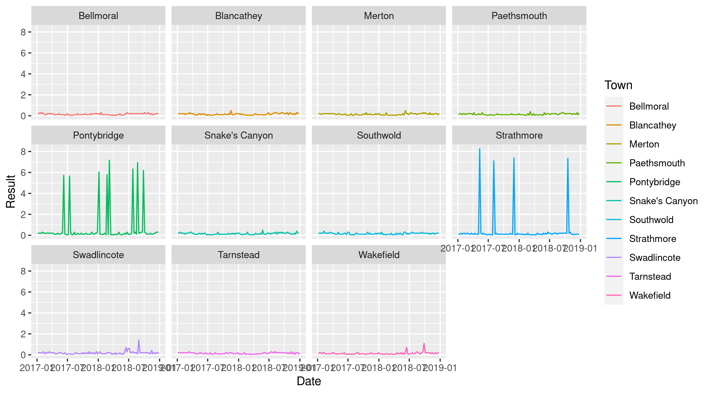

Q> This graph includes a redundant aesthetic. Which aspect of this graph would you remove?

### Statistics
Now that we have an powerful tool to visualise a time series, we also want to add some additional elements that allow us to tell a story. At the moment, our time series is just a series of lines. 

The example below adds two further layers that help to tell a story (Figure 6.12). The first three lines create a data frame with the highest measured THM value for each day.

The `geom_smooth()` function draws a regression line on the canvas. The Loess function is the default, but it can also be used for linear and other regression models. Note how the smoothing line is drawn first, so it stays in the background. In ggplot, subsequent geometries are plotted on top of the previous ones. 

The story is completed by drawing a red horizontal line at 0.25 mg/l, which is the regulatory limit, using the `geom_hline()` geometry.

We have now reached a point where a graph tells a story. This visualisation tells us that there is a flat trend in THMs, but that we had several spikes above the regulatory limits.

{format: r, line-numbers: false}
```
thm <- filter(gormsey, Measure == "THM")
thm_grouped <- group_by(thm, Date)
thm_max <- summarise(thm_grouped, thm_max = max(Result))

ggplot(thm_max, aes(Date, thm_max)) + 
    geom_smooth() + 
    geom_line() + 
    geom_hline(yintercept = 0.25, col = "red")
```

{width: 100%, align: "center"}
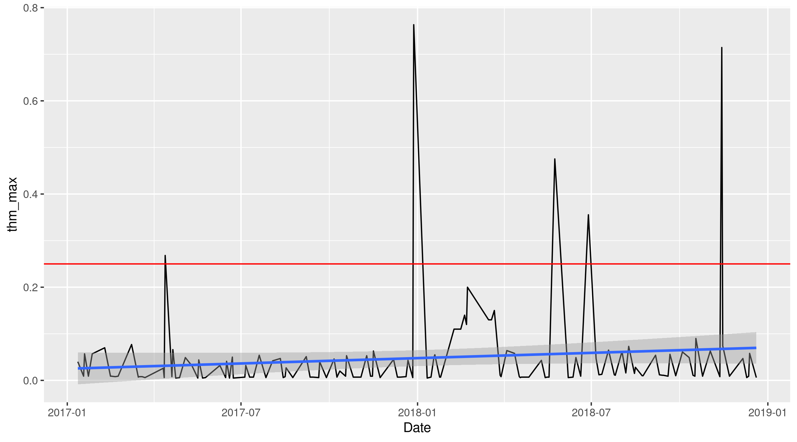

### Coordinates
The ggplot package has extensive functionality to manipulate coordinate systems and axes. The example below shows how to convert the y-axis to logarithmic and rotate the graph so that the y-axis is horizontal to make more room for the labels.

{format: r, line-numbers: false}
```
ggplot(turbidity, aes(Town, Result, fill = Town)) + 
    geom_boxplot() +
    scale_y_log10() +
    coord_flip()
```

### Themes
The theme of a graph defines the aesthetic aspects of the background, fonts, axes and so on. The *ggplot2* library has extensive options to change the theme of a graph. Every element of the canvas colours and lines, text sizes, fonts, and so on can be changed. This is quite a complex topic due to the countless variations.

The *ggplot2* package contains a collection of predefined themes. To use one of these themes, simply add `theme_name()` to the *ggplot* call and replace 'name' with the name of the theme, for example:

{format: r, line-numbers: false}
```
ggplot(turbidity, aes(Date_Sampled, Result)) + 
    geom_line() + 
    facet_wrap(~Zone, ncol = 1) + 
    theme_void(base_size = 20)
```

You can try different themes by typing `theme_` and hit tab to see the available themes. The writing in ggplot can be a bit small, and you can change this with the `base_size = x` option, where `x` is an integer.

X> Try various themes and select the one that suits you best.

{width: 100%, align: "center"}
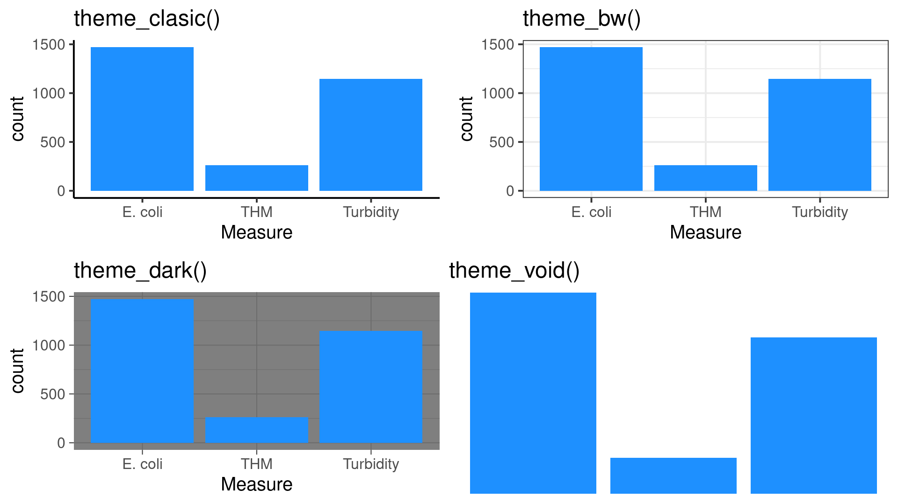 

The void theme removes all axes and background, so we only see the geometries.  This code creates eleven lines that communicate the trend to the viewer, without worrying about the mathematical details (Figure 6.13), a so-called sparkline. 

{width: 100%, align: "center"}
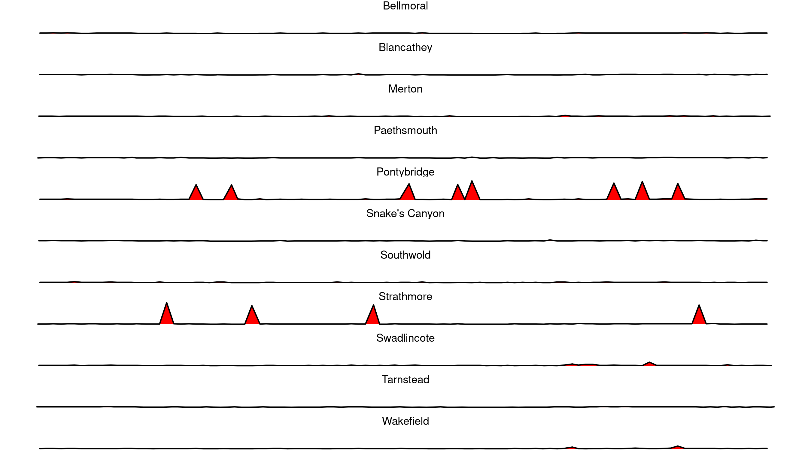

The graphs we have created so far don't include much context to know what we are looking at. The `labs()` function is useful to add text to the plot and change the axes labels, as shown in the example below (Figure 6.14). Adding text to plot prevents any confusion in case the file is separated from its context.

{format: r, line-numbers: false}
```
ggplot(filter(turbidity, Town == "Strathmore"), aes(Date, Result)) + 
    geom_line() +
    geom_hline(yintercept = 5, col = "red") + 
    labs(title = "Turbidity Spikes", 
         subtitle = "Bealiba customer taps",
		 caption = "Source: Gormsey laboratory",
         x = "Date sampled", y = "NTU") + 
    theme_bw(base_size = 10)
```
{width: 100%, align: "center"}


This visualisation is an example of a complete data story. Anyone looking at this graph has all information available to draw the conclusion that we had three spikes of turbidity data in Strathmore, sourced from the Gormsey laboratory. The graph is easy to read, and the criterion for what constitutes a spike is also visible.

## Sharing visualisations
Showing the graphs on the screen is fine, but you will most likely want to share it with colleagues. The `ggsave()` function provides a convenient method to save a *ggplot2* graph to a file in png, pdf, jpg or many other formats. The default settings save the figure at a high resolution of 300 dpi, which is suitable for printed publications. The width and height default to inches. The `ggsave()` function always saves the most recent plot.

{format: r, line-numbers: false}
```
ggsave("test.png", width = 8, height = 4)
```

Almost all images in this chapter are generated with the `ggsave()` function. The code to create these visualisations is available in the `manuscript/resources/08_visualisation` folder of your course material. 

This chapter is only a very brief overview of the principles as the capabilities of this package are extensive. The Tidyverse website contains comprehensive information about the ggplot2 package.

## Assignment

D> Select a story you want to tell from the Gormsey data (or your own data set) and share a self-explanatory ggplot visualisation on the [discussion forum](https://community.leanpub.com/c/r4h2o).

## Further Study

The [Data Visualisation Cheat Sheet](https://raw.githubusercontent.com/rstudio/cheatsheets/master/data-visualization-2.1.pdf) provides a comprehensive summary of the functionality in ggplot.

The [next chapter](#dataproducts) discusses a reproducible method to share the results of your analysis with colleagues or the general public with a slide deck.

