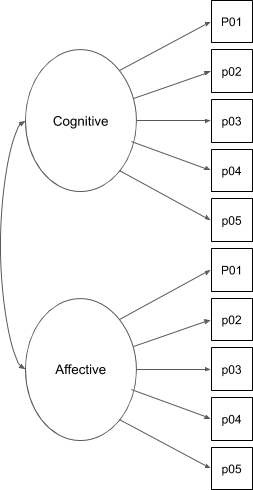
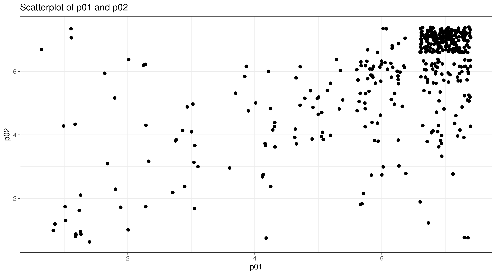
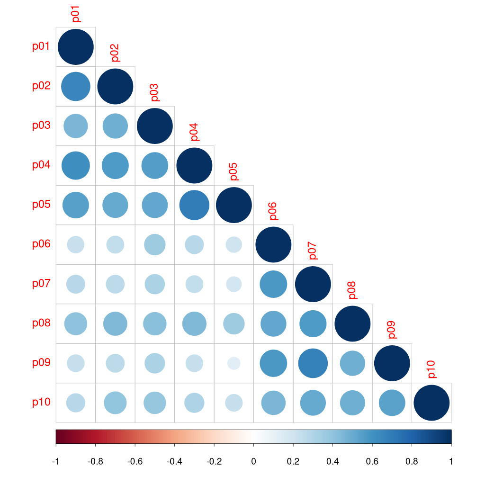
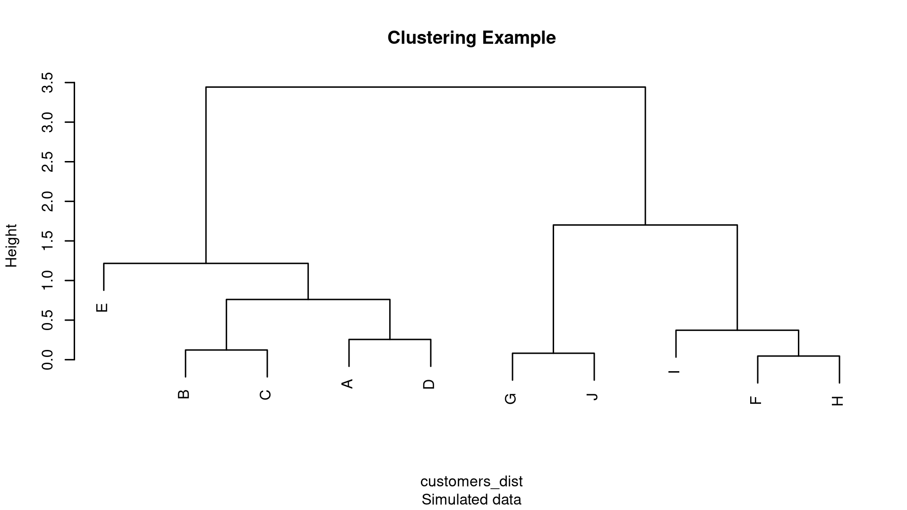
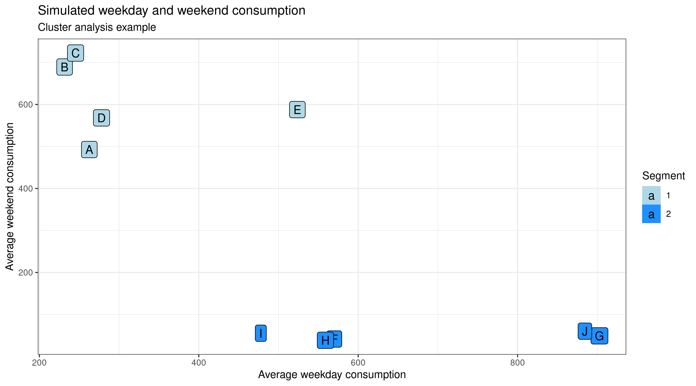
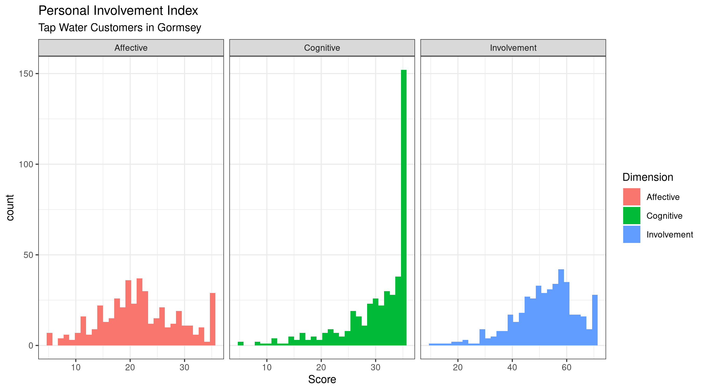

# 10. Analysing the customer experience {#survey}
The code in the previous two chapters cleaned customer survey data and explored the content of the involvement construct. We will dig deeper into the involvement data to test its reliability and validity. We will write some code to reduce the number of dimensions so we can draw a conclusion about the level of involvement. 

Water professionals often focus on the tangible aspects of water services and measure performance in cubic metres, gallons or kilolitres. The customer experience does not relate to these physical variables as it is a psychological dimension. 

While water utilities tout their services as essential for life, only a small amount of water consumption is required to sustain life. Most water consumption meets other critical needs, such as social belonging and self-esteem. For example, our daily shower is not strictly necessary for health reasons. Anthropologically, the daily shower is a ritual that prepares us for the day. The daily shower is perhaps one of the greatest contributes to the economy because it is also a contemplative moment where we have our great ideas (figure 10.1). This qualitative aspect adds additional complexity to how we analyse this data.

{width: 60%, align: middle}


This chapter discusses how psychographic surveys relate to consumer psychology and some techniques to analyse this type of data. The learning objectives for this chapter are:

* Asses the reliability and validity of customer surveys
* Create and visualise a correlation matrix
* Use hierarchical clustering to reduce data dimensions

The data and code for this session are available in the `chapter_10.R` file in the `casestudy2` folder of your RStudio project.

## The Reliability of Surveys
As discussed in the [first chapter](#datascience), data science needs to be valid and reliable. Validity in this sense means that a survey actually measures the psychological construct we seek to understand. Reliability means that the responses have an acceptable level of accuracy.

Measuring subjective phenomenons such as involvement and customer satisfaction requires special techniques to ensure that we can draw valid conclusions. This section introduces some principles of analysing subjective measures, which are applied in the remainder of this chapter.

The purpose of a survey is often to determine the respondent's state of mind. Within the marketing context, surveys are used to measure psychological constructs such as customer satisfaction, trust, brand perception and consumer involvement. 

Unlike physical measurements in a water treatment plant, the state of mind of a consumer cannot be measured directly. Even the latest brain scanning techniques are unable to measure how satisfied a customer is when using a product or any of the other phenomenons we might want to measure.

Surveys are the most common way to measure psychological constructs. The underlying assumption behind measuring a survey is that a causal relationship exists between the respondent's state of mind and the answers they provide on the survey. 

The state of mind of the customer is a latent variable, which means that it cannot be directly observed. We can only infer these variables by analysing manifest (observable) variables. The manifest variables in the case of a survey are the answers that respondents provide.

Asking a single direct question, such as "How much do you trust the water utility?" or "How involved are you with tap water?" are not suitable methods to measure latent variables. Firstly, these questions assume that the respondent and the researcher have the same understanding of what trust and involvement means. Secondly, with only one item, it is impossible to assess the reliability of the responses.

The _Personal Involvement Inventory_ is a statistically validated psychological construct. This means that the researchers followed a formal process to assess the validity and reliability of the survey tool. 

Figure 10.2 shows the theoretical model for the Personal Involvement Inventory and the ten questions. The ovals are latent the variables, and the squares are the manifest (measured) variables. The manifest variables are the answers to the survey questions. The straight arrows imply causality and the curved arrow indicates a correlation. This diagram thus means that involvement has cognitive and affective dimensions that correlate with each other. These two latent variables cause the respondent to answer each of the five items. The stronger the latent variable, the higher the response on the survey item.

{width: 25%, align: middle}


This diagram shows how we can reduce the ten questions to one or two items. If all manifest variables within one construct correlate highly with each other, then we have reason to believe that the survey is reliable. We can also use other techniques, such factor analysis to reduce the ten survey questions to one or two dimensions.

Measuring latent variables is complicated because we need to account for a lot of issues. Firstly, the structure of the questionnaire and the wording of the questions can introduce [response bias](https://en.wikipedia.org/wiki/Response_bias). A bias is a situation where the respondent provides a response that is not causally related to the construct we like to measure. A bias introduces a systematic error in the analysis. Researchers have identified many causes of response bias. We have already seen how the survey managed inattentive customers with a trap question.


## Correlations
The first step to assess the reliability of survey questions is to test the intercorrelation between the items. In the case of the ten involvement questions, if the responses highly correlate with each other, then we can be more justified in reducing the ten responses to one. Following the model in Figure 10.1, we can expect `p01-p05` and `p06-p10` to be highly positively correlated.

The R language provides some functions to calculate correlations. Before we can do this, we need to convert the data structure from long to wide format. In the previous chapter, you saw the `pivot_longer()` function. The tidyr package also provides the `pivot_wider()` function, which achieves the reverse. Alternatively, you can, of course, start again from the raw data.

The [tidyr](https://tidyr.tidyverse.org/) package documentation provides a detailed explanation. Each Tidyverse package has a pdf cheat-sheet that provides a concise overview of the functionality.

{format: r, line-numbers: false}
```
library(readr)
pii_long <- read_csv("casestudy2/pii_long.csv")

library(tidyr)
pii_wide <- pivot_wider(pii_long, names_from = Item, values_from = Response)
```

X> Run this code and investigate the results. Read the package documentation to help you understand the code.

The `cor()` function calculates the correlation between two vectors. The output of this function is a single number. We find that the correlation between `p01` and `p02` is approximately 0.65. We could do the same action for all combinations, but that would be tedious. The correlation function can also analyse a whole data frame at once. In this case, we need to remove the first column because it is not a numerical variable.

{format: r, line-numbers: false}
```
cor(pii_wide$p01, pii_wide$p02)

c_matrix <- cor(pii_wide[, -1])
round(c_matrix, 2)
```

The output of this code is a matrix of correlations between all combinations of `p01` to `p10`:

```
     p01  p02  p03  p04  p05  p06  p07  p08  p09  p10
p01 1.00 0.66 0.45 0.62 0.54 0.23 0.27 0.40 0.24 0.28
p02 0.66 1.00 0.49 0.56 0.51 0.24 0.27 0.44 0.27 0.40
p03 0.45 0.49 1.00 0.55 0.52 0.35 0.31 0.42 0.32 0.39
p04 0.62 0.56 0.55 1.00 0.70 0.27 0.24 0.45 0.24 0.31
p05 0.54 0.51 0.52 0.70 1.00 0.20 0.18 0.35 0.13 0.24
p06 0.23 0.24 0.35 0.27 0.20 1.00 0.58 0.51 0.58 0.46
p07 0.27 0.27 0.31 0.24 0.18 0.58 1.00 0.56 0.68 0.51
p08 0.40 0.44 0.42 0.45 0.35 0.51 0.56 1.00 0.49 0.48
p09 0.24 0.27 0.32 0.24 0.13 0.58 0.68 0.49 1.00 0.54
p10 0.28 0.40 0.39 0.31 0.24 0.46 0.51 0.48 0.54 1.00
```

The diagonal correlations are logically all 1.00, and all values are repeated above and below the diagonal.

The `cor()` function provides various ways to deal with missing data. Read the help file of this function to learn about the options. In this case, all missing data was removed previously and thus does not need to be accounted for. 

This function provides the common Pearson correlation by default. In some specific cases, you might need to use different methods, which this function can also evaluate. The standard method for correlations works best with normal distributions. 

X> Read the help file for the correlation function with `help(cor)`.

We can glance at the output and note that all correlations are positive, which is a first confirmation of the reliability of the PII data. If the questions did not all relate to an underlying latent variable, then the correlation matrix would be less uniform. A uniform correlation matrix suggests that the data possibly describes an underlying phenomenon, which in the case is a consumer’s involvement with tap water.

The basic R functionality also has a function to test the statistical validity of a correlation. The `cor.test()` function takes two vectors as input and provides the 95% confidence interval. 

X> Evaluate this code in the console and review the output.

{format: r, line-numbers: false}
```
cor.test(pii_wide$p01, pii_wide$p02)
```

The output provides a wealth of statistical information about this correlation:

```
	Pearson's product-moment correlation

data:  pii_wide$p01 and pii_wide$p02
t = 18.273, df = 437, p-value < 2.2e-16
alternative hypothesis: true correlation is not equal to 0
95 percent confidence interval:
 0.6016030 0.7081116
sample estimates:
      cor 
0.6581375 
```

The `t` and `df` values relate to the significance statistics. The `p` value tells us that the relationship between these to variables is based on coincidence is very small (`p < 2.2 10^{-16}`$). In social science, a value of less than 0.05 is often considered statistical significant. However, you need to be careful in interpreting this outcome as a correlation is only a starting point for analysis.

Correlations can be visualised with a scatter-plot with each of the variables on the x and y-axes. The `geom_point()` geometry in the ggplot package creates scatter-plots. Visualising the data from the survey this way is problematic because we only have responses between 1 and 7 and many points will be plotted on top of each other, so-called overplotting. One of the solutions to this problem is to add jitter to the data. Jitter is a small random amount f variation applied to each data point. The ggplot package uses the jitter geometry (`geom_jitter()`) to implement this technique. 


{format: r, line-numbers: false}
```
ggplot(pii_wide, aes(p01, p02)) + 
    geom_jitter() + 
    labs(title = "Scatterplot of p01 and p02") + 
    theme_bw(base_size = 10)
ggsave("manuscript/resources/10_surveys/scatterplot.png", width = 9, height = 5)
```



Creating a scatter plot for each permutation in the data would be a lot of work. Several specialised R packages provide functionality to visualise a correlation matrix. The corrplot package provides extensive functionality to visualise correlation matrices. Remember that before you can use this library, you need to install it with `install.packages("corrplot")`.

{format: r, line-numbers: false}
```
library(corrplot)
corrplot(c_matrix, type = "lower")
```

{align: middle, width: 60%}


Figure 10.3 shows that the first five items correlate more strongly with each other than with the other five items, and vice versa. This is another indication that the model for PII matches what we see in this survey.

X> Read the [corrplot documentation](https://cran.r-project.org/web/packages/corrplot/vignettes/corrplot-intro.html) and create different versions of this correlation matrix.

However, correlations are an insufficient metric to draw conclusions about the world. A strong correlation is only an invitation to undertake further research. The old adage 'correlation is not causation' certainly is valid in this case. 

> Correlation is not causation.

The strong correlation between the survey items does not mean that these responses cause each other. Instead, the correlation indicates that there might be an underlying cause that causes them to correlate. This cause is the psychological construct of involvement, which is what we set out to measure.

## Hierarchical Clustering to assess validity
The correlation matrix indicates that the responses from customers are reliable as the individual items strongly relate to each other. But how do we know that these ten items point to a single latent variable? In other words, are the results of this survey valid; are we actually measuring an underlying psychological phenomenon?

Several methods are available to reduce the ten survey dimensions two one or two latent variables. Best practice in psychometric analysis is factor analysis and structural equation modelling. The [psych package](http://personality-project.org/r/) provides extensive functionality to undertake such an analysis. Structural equation modelling is a complex topic that is outside the scope of this course.

Another method to reduce the dimensions of a set of data is hierarchical clustering. Clustering is a method to detect patterns in data. Various methods are available to identify clusters, such as _k_-means and hierarchical clustering, which we implement in this case study.

The basic idea of hierarchical clustering is that the algorithm calculates the 'distance' between data points as if they were situated in a geometric space of _n_ dimensions. The algorithm then groups the points that are closest to each other. When the algorithm has identified all clusters, it proceeds to clusters these groups. This process continues until all observations are part of the same cluster.

Various techniques are available to calculate distances and to determine the nearest neighbour. In this chapter, we use the default values in the R functions, which calculates the Euclidean distance between points. The video below explains the principles of this technique in more detail.

Euclidean distance: `d(p,q) = \sqrt{(p_1- q_1)^2 + (p_2 - q_2)^2+\cdots+(p_i - q_i)^2+\cdots+(p_n - q_n)^2}`$

{width: 60%, align: middle}


In machine learning, clustering techniques are often used to reduce the number of variables in a predictive model. Clustering is also a technique that we can use to segment customers by grouping them together.

The basic principle of cluster analysis is to group observations based on their measured features. In this case study, our observations are the ten variables, and the features are the responses provided by customers. We are looking for those items among `p01` to `p10`, that have a similar response pattern. The correlation plot in Figure 10.2 already hints to the answer to this problem.

Hierarchical clustering involves five steps:
1. Pre-process the data
2. Scale the data
3. Calculate the distances
4. Cluster the data
5. Review the outcome

The next five sections show how to undertake cluster analysis using a simple two-dimensional example before we analyse the involvement survey data. The simple example contains data from 10 customers (A--J). 

The first data dimension in the test data is the average consumption during the week and the second dimension is daily consumption on the weekends. The data consists of random numbers with a known distribution. The code is not explained, and you can reverse-engineer it at your leisure.

{format: r, line-numbers: false}
```
set.seed(1969) #Always create the same pseudorandom variables
customers <- tibble(id = LETTERS[1:10],
                    weekday = c(rnorm(5, 155 * 2.7, 200), rnorm(5, 750, 200)),
                    weekend = c(rnorm(5, 250 * 2.7, 200), rnorm(5, 50, 10)))

ggplot(customers, aes(weekday, weekend)) +
    geom_label(aes(label = id)) +
    labs(title = "Simulated weekday and weekend consumption",
         subtitle = "Cluster analysis example",
         x = "Average weekday consumption", y = "Average weekend consumption") +
    theme_bw(base_size = 10)						
```

{width: 100%, align: middle}


X> Practice your skills and create a correlation matrix of the customer water consumption table.

### Pre-processing
For hierarchical clustering, the columns need to contain the features by which we want to cluster (the observations), and the rows need to hold the variable we want to cluster by.

The data in the example is in the format we want it to be as the rows contain the clustering variable, and the columns are the features by which we seek to cluster.

### Scaling
When the features are not measured with the same method, we first need to normalise the data. We don't need to do so in this case because all features are in volume per day. If, for example, we try to segment customers and we have their average daily water consumption, the number of times they contact the utility, and whether they are in a hardship program, then we have three very different variables that need scaling.

The `scale()` function normalises data. The default setting of this function calculates the mean and standard deviation of the entire vector, then scales each element by subtracting the mean and dividing the result by the standard deviation. The output of the `scale()` function is a matrix with normalised observations.

A matrix in R is different from a data frame because all observations are of the same type, and you can undertake algebra with its content. A data frame can store observations of many kinds, as long as each column has the same kind of data.

The input for the scale function in this example are the features of the customers data frame (excluding the first column as this is an identifier).

{format: r, line-numbers: false}
```
customers_scaled <- scale(customers[, -1])
```

### Distances
Hierarchical clustering requires the distance between observations. With two or three dimensions, this is fairly easy to understand. The most common method is to calculate the Euclidean distance, using the famous Pythagoras formula for two dimensions:

`d = \sqrt{(x_1 - x_2)^2 + (y_1 - y_2)^2}`$. 

The output of this function is a matrix with the same size as the number of cluster observations. In the example, we are clustering ten customers, so the result is a ten by ten matrix with a 'distance' between each of them. However, the matrix only contains the lower triangle. Review the output of the function in the console.

{format: r, line-numbers: false}
```
customers_dist <- dist(customers)
pii_dist <- dist(pii_scaled)
```

### Clustering
Now we can find the customer segments. Hierarchical clustering method iterative groups observations until all are clustered into one cluster with all observations. In the example, customers (A, D), (B, C), (F, H) and (G, J) are the evident first clusters (figure 10.2). The algorithm then looks for the next level, which consists of the clusters ((A, D), (B, C)), and ((F, H), I). The next step clusters A--E and F--J in two clusters and lastly, all customers are assigned to the supercluster.

{format: r, line-numbers: false}
```
customer_clusters <- hclust(customers_dist)
```

The output of the `hclust()` function is a summary of the clustering results. When printing it in the console, you get the following result:

{line-numbers: false}
```
Call:
hclust(d = customers_dist)

Cluster method   : complete 
Distance         : euclidean 
Number of objects: 10 
```

This is not very helpful, and the best way to view the output is to plot it, which gives a dendrogram (tree diagram). The code below uses the base plotting functionality in R and not the ggplot version we have used previously. The `main` and `sub` options provide the title and subtitle to the plot. The `labels` option adds the names to the cluster numbers.

{format: r, line-numbers: false}
```
plot(customer_clusters,
     main = "Clsutering Example",
     sub = "Simulated data",
     labels = customers$id)
```

{width: 100%, align: middle}


You can view the clusters at each level of the analysis, working your way up to one supercluster. The vertical distance in the graph relates to the distance matrix. The longer the line, the less related the customers are. Visually, both figure 10.2 and figure 10.3 suggest that we should have two clusters. In this case, we only have two features, which are easy to visualise. In reality, we often have a lot more than three features which are not easy to visualise on a two-dimensional screen.

You can extract more information from the clusters with the `cutree()` function. This function allows you to cut the tree at a certain level. The output is a vector of the cluster number that each customer belongs to. At the highest level (`k = 1`), all customers form part of the same cluster. At the lowest level (`k = 10`), all customers are separate.

Extracting two clusters, we can assign these variables as segments to our customer table and visualise the data. Note the `fill = factor(segment)`. This option assigns a fill colour to the label. The factor function is needed to force R to assign qualitative colours instead of a variable range. 

X> Evaluate this function without the `factor()` function to understand the difference.

{format: r, line-numbers: false}
```
customers$Segment <- cutree(customer_clusters, k = 2)

ggplot(customers, aes(weekday, weekend)) +
    geom_label(aes(label = id, fill = factor(Segment))) +
    labs(title = "Simulated weekday and weekend consumption",
         subtitle = "Cluster analysis example",
         x = "Average weekday consumption", y = "Average weekend consumption",
         fill = "Segment") +
    theme_bw(base_size = 10)
```

{width: 100%, align: middle}


Two clusters are the obvious answer for this problem, but in reality, the boundary between clusters is not always this clear. Interpreting the results and selecting the ideal number of clusters is a combination of scientific insight and statistical analysis.

### Interpreting the Results
Clustering is just like a correlation and can be easily misinterpreted. You cluster any data, and you will find clusters, but that does not imply that these clusters are meaningful. Some statistical techniques exist to assess how well the chosen model fits the data, but there is no single objective criterion to determine the ideal number of clusters. The statistical methods also often don't provide a conclusive answer.

How do we know the ideal number of clusters? The dendrogram helps to visually review the number of clusters. The customer data is clearly best fitted with two clusters. The vertical line of the two clusters is the longest, which means the distance between the two clusters is larger than the distance between the other clusters. 

The two-cluster, or segment, solution, is also suitable because it is reasonably logical that residential customers use water in the weekend, while large commercial customers might use much less water.

The main criterion for the result of cluster analysis is that it makes sense. We strive for parsimony, which means that we want to have the lowest possible number of clusters. But having too few clusters also does not help us much in explaining the structure of the data. The main criterion is whether the cluster model explains the variability of reality.

The final answer depends on the purpose of the analysis, how the data was collected, and on the theoretical assumptions embedded.

### Clustering the Involvement Data
The data from the involvement survey needs to be transformed again to make it suitable for hierarchical clustering. The observations of the PII survey are the individual customers (the rows), and the features are the ten items (the columns). In this case, our interest goes to the items themselves. We thus need to rotate or transpose the data frame. We can do this with the transpose `t()` function. This function transposes rows to columns and vice versa. The code below rotates the wide survey data, excluding the `survey_id` parameter.

{format: r, line-numbers: false}
```
pii_trans <- t(pii_wide[, -1])
```

The `pii_trans` variable can now be used as an input in the clustering process.

X> Undertake hierarchical clustering for the Personal Involvement Index data. Try to write the code as one single pipe with the `%>%` operator. The result should look like Figure 10.5.

T> Use `rect.hclust(pii_clusters, k = 2, border = 2:3)` to draw a rectangle around the two-cluster (`k = 2`) solution. The `border = 2:3` defines the colour numbers of the two rectangles.

{width: 100%, align: middle}


We can see that the largest trunk in the dendrogram is with two clusters. We can safely choose this solution because the survey was designed as a two-dimensional construct. We can also see that the cluster analysis confirms the correlation matrix. The first five and the last five items are closest related to each other. 

This analysis means that we can reasonably sure that each of these five items measures the same underlying latent variable.

### Other techniques
Hiereachical clustering is not the only technique that is available to cluster data. Another popular algorithm is _k_-means, which performs better when you analyse large sets of data.

This article by George Serif provides a comprehensive overview of the various [methods to cluster data](https://towardsdatascience.com/the-5-clustering-algorithms-data-scientists-need-to-know-a36d136ef68) and their differences.

## Reviewing the Personal Involvement Index
Now that we have shown that the first five and the last five questions cluster into one latent variable, we can review the level of involvement with tap water reported by the customers. 

The easiest way to do this is by adding the scores for the questions for each dimension and add a total score.

The code below groups the data by survey id (by customer) and calculates the new scores with the `mutate()` function. This function creates a new variable in the data frame. You can add more than one new variable within one function all, as shown below. 

After we have these three variables, we can pivot the data around these values and ditch the individual responses.

{format: r, line-numbers: false}
```
pii <- pii_wide %>%
    group_by(survey_id) %>%
    summarise(Cognitive = p01 + p02 + p03 + p04 + p05,
              Affective = p06 + p07 + p08 + p09 + p10,
              Involvement = Cognitive + Affective) %>%
    pivot_longer(Cognitive:Involvement, 
                 names_to = "Dimension",
                 values_to = "Score")
```

The next code snippet visualises the data with the histogram geometry. The `bins = 30` option defines the number of columns of the histogram. The `scales = "free_x"` option means that for each facet, a different x-scale can be used.

X> Review this code and try different options for this visualisation. What happens when you remove or change these two additional options?

{format: r, line-numbers: false}
```
ggplot(pii, aes(Score, fill = Dimension)) + 
    geom_histogram(bins = 30) + 
    facet_wrap(~Dimension, scales = "free_x") + 
    labs(title = "Personal Involvement Index",
         subtitle = "Tap Water Customers in Gormsey") + 
    theme_bw(base_size = 10)
```

{width: 100%, align: middle}


These results are intriguing as the level of cognitive involvement is much higher than affective involvement. Customers see water more as a necessity than as something they have a relationship with. The level of affective involvement is, however, quite high compared to other commodities. This score is perhaps an expression of the types of benefits that we obtain from using tap water. The two involvement dimensions have a different distribution. While affective involvement is more or less a normal distribution, cognitive involvement is highly positively skewed.

D> How would you interpret these scores? How do you explain the significant spike at the highest level of involvement?

### Further study
Accurate measurement of psychological constructs is a complex topic that goes beyond the scope of this course. Please note that the examples in this chapter do not constitute a thorough analysis of latent constructs. Correlations and cluster analysis are great for exploration. Structural equation modelling is best practice in psychographic analysis. If you are interested in the statistical intricacies of measuring the customer experience, then read _Scale Development: Theory and Applications_ by Robert Devils (2011). 

## Quiz
The sixth quiz asks some questions about correlations and cluster analysis.

The [next chapter](#customers) invites you to further analyse the information in the customer survey data and create a report with RMarkdown.

{quiz, id: q6, attempts: 10}
# Quiz 6: Correlations and Clustering
The following questions test your comprehension of some of the theory and functionality explained in this chapter. Test your answer by evaluating the code in the console.

X> Load the cleaned customer survey data you created in session 8. 

? What is the correlation between the level of self-reported hardship and the frequency at which they contact their utility? 

I> Remember to manage the missing variables with the `use` option in the correlation function. Check the help file for the correlation function to select the correct option.

A) 0.483
b) NA
c) 1
d) 0.12

? What is the likelihood that the relationship between these two variables is coincidental?

a) 0.05
b) Impossible to tell
C) close to 0
d) 0.483

X> Isolate the variables that start with the letter `t` or `f` from the customer data. This data relates to questions about service quality. Transform the data and undertake a hierarchical cluster analysis and review the dendrogram.

? How many latent variables would you assign these 18 variables to?

a) None
b) Three
c) Four
D) Two

? Determine the total score for `t01` to `t05` for each respondent. What is the mean value of this latent construct?

I> Use the `mutate()` function to add variables for each respondent.

A) 27.6
b) 20.9
c) 6.7
d) NA

That is it for the sixth quiz. If you get stuck, you can find the answers in the `quiz_06.R` file in the `casestudy2` folder. You can also watch the video to see the solutions.

The [next chapter](#customers) invites you to further analyse the information in the customer survey data and create a report with RMarkdown.
{/quiz}
