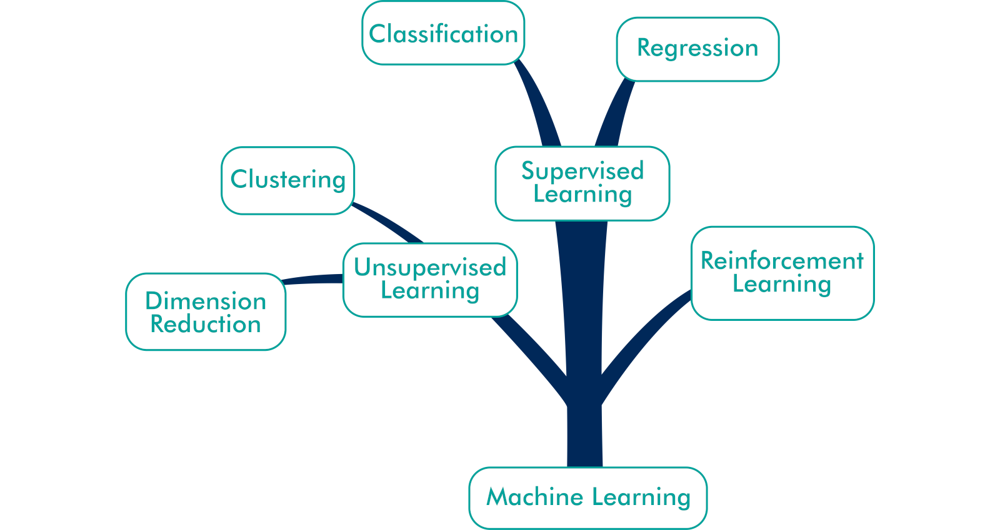

# 16. Principles of Machine Learning {#learning}

The words machine learning and artificial intelligence are often used to tout the seemingly magical powers of mathematics. 

This chapter 

## What is Machine Learning?
Machine learning is without a doubt the poster child of data science. This popular technique possibly promises more than it is able to deliver. Machines cannot actually learn anything. Machine learning is a group of complex algorithms that convert the input into output by recognising patterns in data. The term was coined by Arthur Samuel from IBM in 1959 to promote their capabilities in software development.[^ml]

[^ml]: Burkov, A. (2019). _The Hundred-Page Machine Learning Book_. LeanPub.

Machine learning is a branch of Artificial Intelligence (AI). The set of algorithms that are classified as machine learning are part of the AI toolkit but are not the only ways to mimic human reasoning. 

Machine learning works differently to traditional prediction methods because it is the machines themselves that create the equations, not the researcher. The family tree of machine learning has three main branches: supervised and unsupervised methods and reinforcement learning (figure 13).

In supervised methods, the algorithm is provided with a set of training data with known relationships. When, for example, wanting to predict how much a viewer will like a particular movie, the training data consists of verified information about what movies people have watched and how they rated them. A supervised algorithm analyses the training data to discover patterns so that we can predict how likely a viewer will enjoy a new movie. Supervised learning can classify data in groups, or it can regress data to find relationships between variables. 

Recognising cats in images is an example of classification. The algorithm is presented with thousands of labelled images, some of which contain a cat and some don't. The algorithm is taught how to recognise a cat using these examples. Supervised learning is similar to how humans learn to classify the world. As children, we are provided with examples of cats by our parents, after we acquired the skill, we independently classify furry animals as either a cat or something else. 

Regression analysis finds relationships between numerical or categorical variables using independent variables and known dependent variables. The independent variables are the causes of the dependent variable. We might know that the likelihood of rain relates to temperature and moisture content of the air. This mathematical relationship is then used to predict the weather, estimate life expectancy of people or assets and anything else that occurs over time.

One of the most important considerations of supervised machine learning is the size of the training data set. When this set is too large, the algorithm will find patterns where they don't exist, which is called over-fitting. When the data set is not large enough, it will be unable to find any patterns. Fine-tuning a predictive algorithm to deliver reliable predictions is a craft that requires great insight into the algorithm.

Unsupervised methods operate without labelled examples. These algorithms trawl through the data to find patterns. Clustering method detects groups of data in multi-dimensional data. This technique is useful to segment customers using sets of characteristics. Segmenting customers helps organisations to target their marketing. Unsupervised methods can also reduce the dimensionality of data. These techniques are helpful to discover otherwise invisible aspects of the data. Factor analysis and structural equation modelling are examples of methods to analyse social surveys and find underlying patterns.

The output of these machine learning methods is very different from traditional analysis. While scientists wear t-shirts with elegant formulas, the outcomes of machine learning are often utterly incomprehensible to humans. This aspect of machine learning can be a problem as professionals hesitate to accept the outcomes of the algorithm if they can't see or understand the logic that the machine uses to achieve its results. This problem highlights the need for data science education among all professionals and not only specialists.

The third method, reinforcement learning is a technique that is used in prescriptive analysis, which is the topic of the next section.

## Types of Machine Learning
We have already encountered a machine learning technique in [chapter 10](#latent). Cluster analysis is an unsupervised method that in essence learns from the data by investigating relationships,

## Supervised Learning
### Training and Testing data
